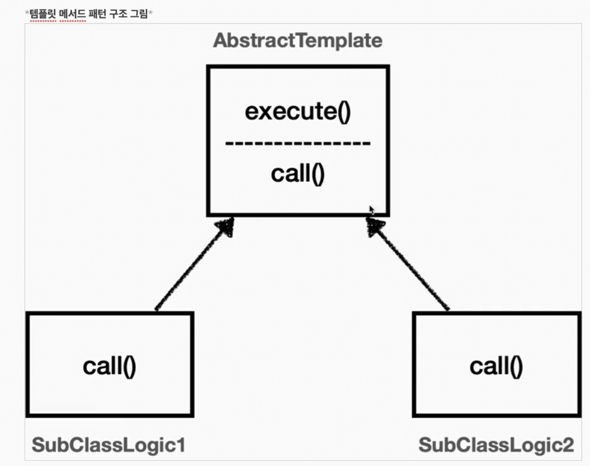
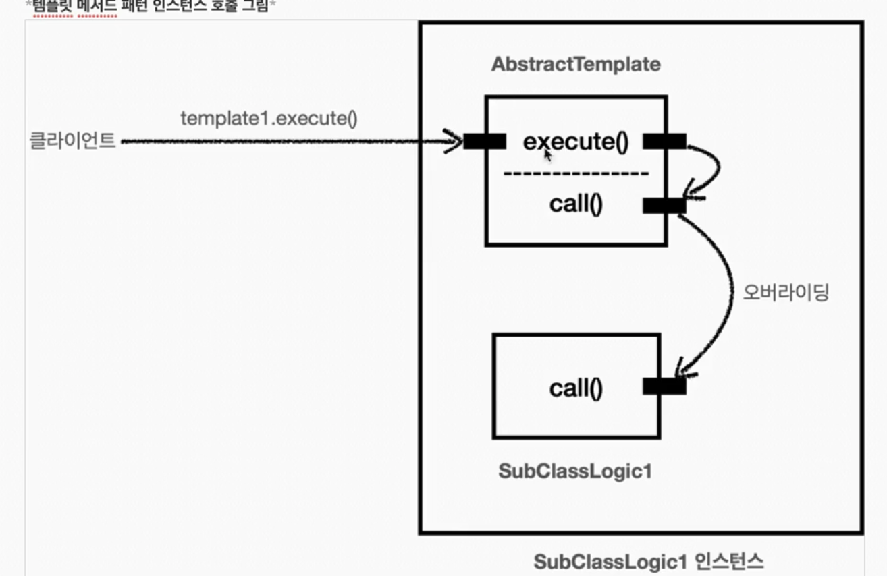

## 템플릿 메서드 패턴과 콜백 패턴

### 템플릿 메서드 패턴 - 시작


**핵심 기능**

해당 객체가 제공하는 고유의 기능

- orderService의 주문 로직인 `orderRepository.save()`


**부가 기능**

핵심 기능을 보조하기 위해 제공되는 기능

- 로그 추적, 트랜잭션 기능
- 부가기능은 단독으로 사용되지는 않고, 핵심 기능과 함께 사용된다.


V0는 핵심 기능만 있지만 V3코드는 핵심 기능과 부가 기능이 함께 섞여있다. 그리고 심지어 로그 추적기의 도입으로 핵심 기능 코드보다 부가 기능을 처리하기 위한 코드가 더 많아져 배보다 배꼽이 커진 상태가 되었다.


**변하는 것과 변하지 않는 것을 분리**

- 부가 기능과 관련된 코드가 중복이니 중복을 별도의 메서드로 뽑아내면 될 것 같지만 쉽지 않다.
- 좋은 설계는 변하는 것과 변하지 않는 것을 분리하는 것


>  템플릿 메서드 패턴(Template Method Pattern)은 이런 문제를 해결하는 디자인 패턴이다. 


### 템플릿 메서드 패턴 - 예제 1

```java
    @Test
    void templateMethodV0() {
        logic1();
        logic2();
    }

    private void logic1() {
        long startTime = System.currentTimeMillis();

        // 비즈니스 로직 실행
        log.info("비즈니스 로직1 실행");
        // 비즈니스 로직 종료

        long endTime = System.currentTimeMillis();
        long resultTime = endTime - startTime;

        log.info("resultTime = {}", resultTime);
    }

    private void logic2() {
        long startTime = System.currentTimeMillis();

        // 비즈니스 로직 실행
        log.info("비즈니스 로직2 실행");
        // 비즈니스 로직 종료

        long endTime = System.currentTimeMillis();
        long resultTime = endTime - startTime;

        log.info("resultTime = {}", resultTime);
    }
```

여기서 변하는 부분과 변하지 않는 부분을 분리해본다.

- 변하는 부분 : 비즈니스 로직
- 변하지 않는 부분 : 부가 기능


### 템플릿 메서드 패턴 - 예제 2




```java
@Slf4j
public abstract class AbstractTemplate {
    public void execute() {
        long startTime = System.currentTimeMillis();

        // 비즈니스 로직 실행
        call(); // 상속
        // 비즈니스 로직 종료

        long endTime = System.currentTimeMillis();
        long resultTime = endTime - startTime;

        log.info("resultTime = {}", resultTime);
    }

    protected abstract void call();
}

@Slf4j
public class SubClassLogic1 extends AbstractTemplate{

    @Override
    protected void call() {
        log.info("비즈니스 로직1 실행");
    }
}


@Slf4j
public class SubClassLogic2 extends AbstractTemplate{

    @Override
    protected void call() {
        log.info("비즈니스 로직2 실행");
    }
}

```

다형성 + 추상클래스로 푼다.

템플릿 메서드 패턴은 이름 그대로 템플릿을 사용하는 방식이다. 템플릿은 기준이 되는 거대한 틀이고, 템플릿이라는 틀에 변하지 않는 부분을 몰아두고 일부 변하는 부분을 별도로 호출한다.




이렇게하면 변하지 않는 부분에 대한 코드 중복이 사라진다.


### 템플릿 메서드 패턴 - 예제 3

**익명 내부 클래스 사용하기**

템플릿 메서드 패턴의 단점은 클래스를 계속 만들어내야한다는 점이다.  

익명 내부 클래스를 사용하면 이런 단점을 보완할 수 있다.


익명 내부 클래스를 사용하면 객체 인스턴스를 생성하면서 동시에 생성할 클래스를 상속받은 자식 클래스를 정의할 수 있다. 이 클래스는 `SubClassLogic1` 처럼 직접 지정하는 이름이 없고 클래스 내부에 선언되는 클래스여서 익명 내부 클래스라고 한다.


```java
    @Test
    void templateMethodV2() {
        AbstractTemplate template1 = new AbstractTemplate() {
            @Override
            protected void call() {
                log.info("비즈니스 로직 1 실행");
            }
        };
        template1.execute();
        AbstractTemplate template2 = new AbstractTemplate() {
            @Override
            protected void call() {
                log.info("비즈니스 로직 2 실행");
            }
        };
        template2.execute();
    }
```

`template1.getClass()` 로 찍어보면 그냥 `TemplateMethodTest$1` 이런식으로 생김


### 템플릿 메서드 패턴 - 적용 1

```java
package hello.advanced.trace.template;

import hello.advanced.trace.TraceStatus;
import hello.advanced.trace.logtrace.LogTrace;

public abstract class AbstractTemplate<T> {
    private final LogTrace trace;

    public AbstractTemplate(LogTrace trace) {
        this.trace = trace;
    }

    public T execute(String message) {
        TraceStatus status = null;
        try {
            status = trace.begin(message);

            // 로직 호출
            T result = call();

            trace.end(status);
            return result;
        } catch (Exception e) {
            trace.exception(status, e);
            throw e;
        }
    }
    
    protected abstract T call();
}

```

- `AbstractTemplate` 은 템플릿 메서드 패턴에서 부모 클래스이고, 템플릿 역할을 한다.
- `<T>` 제네릭을 사용해서 반환타입을 정의한다.
- 객체를 생성할 때 내부에서 사용할 `LogTrace trace` 를 전달 받는다.
- 로그에 출력할 message를 외부에서 파라미터로 전달받는다.
- 템플릿 코드 중간에 `call()` 메서드를 통해서 변하는 부분을 처리한다.
- `abstract T call()` 은 변하는 부분을 처리하는 메서드이다. 이 부분은 상속으로 구현해야 한다.


```java
    @GetMapping("/v4/request")
    public String request(String itemId) {
        AbstractTemplate<String> template = new AbstractTemplate<String>(trace) {
            @Override
            protected String call() {
                orderService.orderItem(itemId);
                return "ok";
            }
        };
        return template.execute("OrderController.request()");
    }
```

```java
    public void orderItem(String itemId) {
        AbstractTemplate<Void> template = new AbstractTemplate<>(trace) {
            @Override
            protected Void call() {
                orderRepository.save(itemId);
                return null;
            }
        };
        template.execute("OrderService.orderItem()");
    }
```

```java
    public void save(String itemId) {
        AbstractTemplate<Void> template = new AbstractTemplate<>(trace) {
            @Override
            protected Void call() {
                if (itemId.equals("ex")) {
                    throw new IllegalStateException("예외 발생!");
                }
                sleep(1000);
                return null;
            }
        };
        template.execute("OrderRepository.save()");
    }
```


### 템플릿 메서드 패턴 - 적용 2

템플릿 메서드 패턴 덕분에 변하는 코드와 변하지 않는 코드를 명확하게 분리했다.


- `OrderServiceV0` : 핵심 기능만 있다.
- `OrderServiceV3` : 핵심 기능과 부가 기능이 함께 섞여 있다.
- `OrderServiceV4` : 핵심 기능과 템플릿을 호출하는 코드가 섞여 있다.


**좋은 설계란**

변경이 일어날 때 단일 책임 원칙이 잘 지켜진다면 좋은 설계라고 생각 한다.  

단순 소스 코드의 길이가 짧아지는 것이 아닌, 변경 지점을 하나로 모아서 변경에 쉽게 대처할 수 있는 구조를 만든 것!


### 템플릿 메서드 패턴 - 정의 

> 템플릿 메서드 디자인 패턴의 목적은, 
>
> 작업에서 알고리즘의 골격을 정의하고 일부 단계를 하위 클래스로 연기한다. 템플릿 메서드를 사용하면 하위 클래스가 알고리즘의 구조를 변경하지 않고도 알고리즘의 특정 단계를 재정의할 수 있다. - GOF

부모 클래스에 알고리즘의 골격인 템플릿을 정의하고, 일부 변경되는 로직은 자식 클래스에 정의하는 것. 이렇게 하면 자식 클래스가 알고리즘의 전체 구조를 변경하지 않고, 특정 부분만 재정의할 수 있다. 결국 **상속과 오버라이딩을 통한 다형성으로 문제를 해결하는 것**


**하지만**

템플릿 메서드 패턴은 상속을 사용한다.

자식 클래스 입장에서 부모 클래스의 기능을 전혀 사용하지 않는데, 다 상속 받고 있음.

특정 부모클래스를 의존하고 있어서 좋은 설계가 아님 (자식 -> 부모 의존)

이런 의존 관계에 의해서 부모 클래스를 변경하면 자식 클래스에도 영향을 줄 수 있다.


템플릿 메서드 패턴과 비슷한 역할을 하면서 상속의 단점을 제거할 수 있는 디자인 패턴이 바로 **전략 패턴** 이다.


