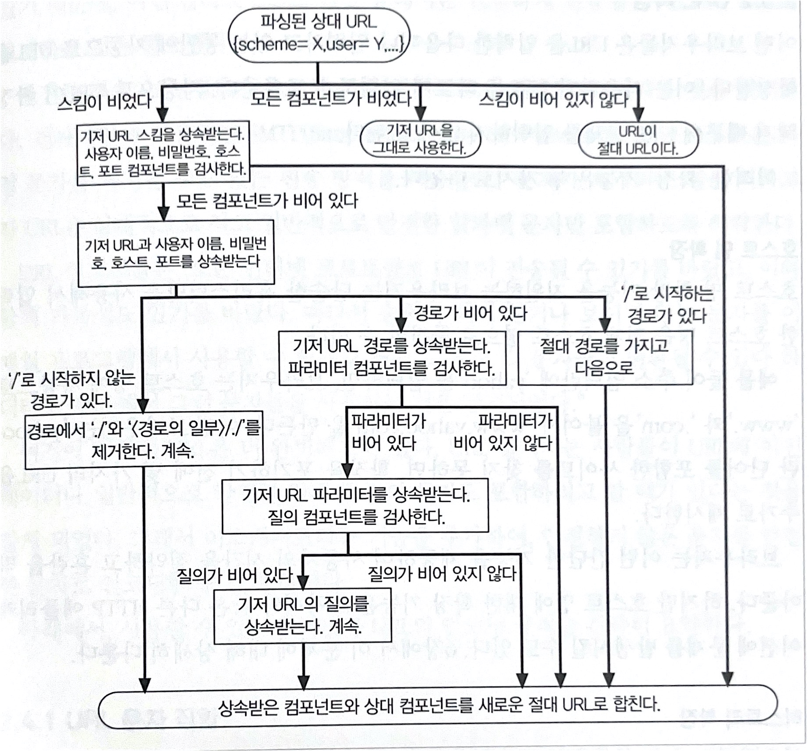
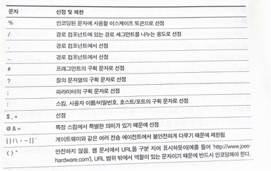

# CH2. URL과 리소스

URL(Uniform Resource Locator)은 리소스를 가리키는 표준 이름이다. URL은 전자정보 일부를 가리키고 그것이 어디에 있고, 어떻게 접근할 수 있는지 알려준다. 

> 리소스 : 웹에서 사용되는 식별할 수 있는 모든 자원을 가리킨다. 

#### 알아볼 내용

- URL 문법, 여러 URL 컴포넌트가 어떤 의미를 가지며 무엇을 수행하는지 
- 여러 웹 클라이언트가 지원하는 상태 URL과 확장 URL 같은 단축 URL
- URL의 인코딩과 문자 규칙
- 여러 인터넷 정보 시스템에 적용되는 공통 URL 스킴
- 기존 이름은 유지하면서 객체들은 다른 장로 옮기는 것을 가능하게 해주는 URN을 포함한 URL의 미래

---

## 1. 인터넷의 리소스 탐색하기

URL은 브라우저가 정보를 찾는데 필요한 리소스의 위치를 가리키며, URL을 이용해 사람과 애플리케이션이 수십억 개의 리소스를 찾고 사용하며 공유할 수 있다. 그리고 URL를 통해 사람이 HTTP 및 다른 프로토콜을 통해 접근할 수 있다. 

- 사용자는 브라우저에 URL을 입력 
- 브라우저는 화면 뒤에서 사용자가 원하는 리소스를 얻기 위해 적절한 프로토콜을 사용하여 메시지전송   

URL는 URI(Uniform Resource Identifier, 통합 자원 식별자)라는 더 일반화된 부류의 부분집합.  

URI는 URL과 URN으로 구성된 종합 개념으로 URN은 리소스가 어디에 존재하든 상관 없이 그 이름만으로 리소스를 식별 ,URL은 리소스가 어디 있는지 설명해서 리소스를 식별  

대부분 URL를 URI와 같이 지칭하며 사용  

#### URL의 구성

URL은 크게 `스킴://호스트(서버위치)/경로`로 구성되어있다.

> http://www.joes-hardware.com/seasonal/index-fall.html

- `http` 
  - URL의 스킴
  - 웹 클라이언트가 리소스에 어떻게 접근하는지 알려줌
  - 이 경우엔 HTTP 프로토콜을 사용
- `www.joes-hardware.com`
  - 서버의 위치 
  - 웹 클라이언트가 리소스가 어디에 호스팅 되어있는지 알려준다. 
- `seasonal/index-fall.html`
  - 리소스의 경로 
  - 서버에 존재하는 로컬 리소스들 중에서 요청받은 리소스가 무엇인지 알려준다.   

URL은 http 프로토콜이 아닌 다른 프로토콜을 사용할 수도 있다.

### 1.1 URL이 있기 전 암흑 시대

URL이 있기 전에는 친구와 어떤 파일을 공유하려면 "~~주소에 ftp로 접속해, ~ 사용자로 로그인한 다음 비밀번호를 입력하고 ~디렉토리로 이동한다음 바이너리 형식으로 전환해서 ~파일을 너의 로컬 파일 시스템으로 내려받은 뒤 보면 돼." 이런식으로 진행  

URL은 애플리케이션이 리소스에 접근할 수 있는 방법을 제공한다. URL을 사용하면 애플리케이션들에서 하나의 인터페이스를 통해 일관된 방식으로 많은 리소스에 접근할 수 있다. URL은 당신과 브라우저에게 정보를 찾는데 필요한 모든 것을 제공하며, 당신이 원하는 리소스가 어디에 위치하고 어떻게 가져오는지 정의한다.  

## 2. URL 문법

리소스는 URL의 스킴을 통해 접근할 수 있으며, URL문법은 스킴에 따라 달라지지만 대부분 일반 URL의 문법을 따른다.   

```text
<스킴>://<사용자 이름>:<비밀번호>@<호스트>:<포트>/<경로>;<파라미터>?<질의>#<프래그먼트>
```

URL의 가장 중요한 세 가지 컴포넌트는 **스킴, 호스트, 경로**이다.

| 컴포넌트    | 설명                                                         | 기본값                                                       |
| ----------- | ------------------------------------------------------------ | ------------------------------------------------------------ |
| 스킴        | 리소스를 가져오려면 어떤 프로토콜을 사용하여 서버에 접근해야 하는지 가리킨다. | 없음                                                         |
| 사용자 이름 | 몇몇 스킴은 리소스에 접근을 하기 위해 사용자 이름을 필요로한다. | anonymous                                                    |
| 비밀번호    | 사용자의 비밀번호를 가리키며, 사용자 이름에 콜론(`:`)으로 이어서 기술 | FTP는 브라우저마다 가지고 있는  기본 값 사용 , 크롬은 이메일 |
| 호스트      | 리소스를 호스팅하는 서버의 호스트명이나 IP주소               | 없음                                                         |
| 포트,       | 리소스를 호스팅하는 서버가 열어놓은 포트번호. 많은 스킴이 기본 포트번호를 가지고 있다 | 스킴에 따라 다름. HTTP는 80                                  |
| 경로        | 이전 컴포넌트와 빗금(`/`)으로 구분되어 있으며 서버 내 리소스가 서버 어디에 있는지 가리킨다.<br/> 경로 컴포넌트의 문법은 스킴에 따라 다르다. 파일 시스템과 유사한 구조를 가진다. | 없음                                                         |
| 파라미터    | 특정 스킴들에서 입력 파라미터를 기술하는 용도로 사용한다. 파라미터는 이름/값을 쌍으로 가진다.<br/> 다른 파라미터나 경로의 일부와 세미콜론(`;`)으로 구분하여 기술. 여러개를 가질 수 있다. <br/>경로 컴포넌트는 경로 조각으로 나뉠 수 있으며 각 조각은 자체 파라미터를 가질 수 있다. <br/><br />`http://www.xx.com/hammers;sale=false/index.html;graphics=true` | 없음                                                         |
| 질의        | 스킴에서 애플리케이션에 파라미터를 전달하는데 쓰인다. URL의 끝에 `?`로 구분한다.  여러개 쓸때는 `&`로 나누어 이어 붙인다. | 없음                                                         |
| 프래그먼트  | 리소스 조각이나 일부분을 가리키는 이름이다. <br/>URL이 특정 객체를 가리킬 경우에 **프래그먼트는 서버에 전달되지 않는다.** (서버는 객체를 전체 단위로만 전송) <br/>서버로 부터 전체 리소스를 내려받은 후 클라이언트에서만 사용한다. URL끝에서 #문자로 구분한다. | 없음                                                         |

## 3. 단축 URL

웹 클라이언트는 몇몇 단축 URL을 인식하고 사용한다. 상대 URL은 리소스 안에있는 리소스를 간결하게 기술하는데 사용할 수 있다. 많은 브라우저가 사용자가 기억하고 있는 일부 URL을 입력하면 나머지 부분을 자동으로 입력해주는 `URL 자동 확장`을 지원한다. 

### 3.1 상대 URL

URL은 상대 URL과 절대 URL로 나뉜다. 상대 URL은 모든 정보를 담고있지 않다. 상대 URL로 리소스에 접근하는데 필요한 모든 정보를 얻기 위해서는 **기저(base)** 라고 하는 다른 URL을 사용해야한다. 

- 상대 URL문법에 따르면, HTML 작성자는 URL에 스킴과 호스트 그리고 다른 컴포넌트들을 모두 입력하지 않아도 된다. 
  - 그 정보는 컴포넌트가 포함된 리소스의 기저 URL에서 알아낼 수 있다. 
- `http://www.joes-hardware.com/tools.html` 가 가리키는 리소스인 HTML에서 `./hammers.html`을 쓴다면 기저 URL을 사용해서 `http://www.joes-hardware.com/hammers.html`이라는 새로운 절대 URL을 얻어낼 수 있다. 
- 상대 URL을 사용하면 리소스 집합을 쉽게 변경할 수 있고, 문서 집합의 위치를 변경하더라도 새로운 기저 URL에 의해서 해석될 것이기 때문에 위치를 변경하더라도 잘 동작할 것이다. 

#### 기저 URL

- 리소스에서 명시적으로 제공
  - HTML문서에서 \<BASE> HTML 태그를 기술
- 리소스를 포함하고 있는 기저 URL
  - 명시되지 않은 리소스에 포함된 경우 해당 리소스의 URL을 기저 URL로 사용
- 기저 URL이 없는 경우
  - 이런 경우는 절대 URL만으로 이루어졌거나, 불완전하거나 깨진 URL일 수도 있다.
- 상대 참조 해석하기
  - 

### 3.2 URL 확장

어떤 브라우저들은 URL을 입력한 다음이나 입력하고 있는 동안에 자동으로 URL을 확장한다. 

#### 호스트명 확장

단순한 휴리스틱만을 사용해서 입력한 호스트명을 전체 호스트명으로 확장할 수 있다. 

- 예를들어 `yahoo`를 입력하면 브라우저는 호스트명에 자동으로 `www`와 `.com`을 붙여 `www.yahoo.com`을 만든다. 
- 어떤 브라우저는 yahoo란 단어를 포함한 사이트를 찾지 못하면 확장을 포기하기 전에 몇가지 URL을 추가 제시한다.

#### 히스토리 확장

브라우저는 사용자가 방문했던 URL 기록을 저장해놓는다.

- URL을 입력하면 입력된 URL의 앞글자들을 포함하는 완결된 형태의 URL들을 선택하게 해준다. 
- `http://www.joes`를 입력하면 `http://www.joes-hardware.com`을 보여준다.사용자는 선택만 하면 된다.  

> 프락시를 사용할 경우 URL 자동 확장 기능은 다르게 동작할 수 있다는 것을 유념하자 (6장 URI 클라이언트 자동 확장과 호스트명 분석)


## 4. 안전하지 않은 문자

URL은 잘 호환되도록 설계되었다. 그리고 URL은 인터넷에 있는 모든 리소스가 여러 프로토콜을 통해서 전달될 수 있도록, 각 리소스에 유일한 이름을 지을 수 있게 설계되었다. 모든 프로토콜이 데이터를 전송하기 위해서 서로 다른 장치를 가지고 있기 때문에 어떤 프로토콜을 통해서든 안전하게 전송될 수 있도록 URL을 설계하는 것은 중요했다.  

**안전한 전송**이란, 정보가 유실될 위험 없이 URL을 전송할 수 있다는 것을 의미한다. SMTP(Simple Mail Transfer Protocol)같은 프로토콜은 특정 문자를 제거할수도 있는 전송방식을 사용한다.(*7비트 인코딩을 사용하기 때문에 소스가 8비트 이상으로 인코딩 되어있으면 정보가 소실될 수 있다*). 

**URL은 문자가 제거되는 일을 피하고자 상대적으로 작고 일반적인 알파벳 문자만 포함하도록 허락한다.** 출력이 되지 않거나 보이지 않는 문자를 금지하고, **이스케이프**라는 기능을 추가하여 안전하지 않은 문자를 안전한 문자로 인코딩할 수 있게 하였다.  

### 4.1 URL 문자 집합

컴퓨터 시스템의 기본 문자 집합 - 보통 영어 중심  

역사적으로 많은 컴퓨터 애플리케이션들이 US-ASCII 문자 집합을 사용해왔다. US-ASCII는 7비트를 사용하여 영문 자판에 있는 키 대부분과 몇몇 출력되지 않는 제어문자를 표현한다. US-ASCII는 유럽 언어나 비 라틴계 언어들에 존재하는 변형된 문자들 까지 지원하지 않는다.  

뿐만 아니라 URL이 특정 이진 데이터를 포함해야 하는 경우

- URL에 이스케이프 문자열을 쓸 수 있게 설계 
- 이스케이프 문자열이란 US-ASCII에서 사용이 금지된 문자열로, 특정 문자나 데이터를 인코딩할 수 있게 함으로써 이동성과 완성도를 높였다. 

### 4.2 인코딩 체계

안전한 문자 집합을 이용하는 경우 그 표현의 한계를 넘기 위해, URL에 있는 안전하지 않은 문자들을 표현할 수 있는 인코딩 방식이 고안되었다. 안전하지 않은 문자를 `%`기호로 시작해 ASCII코드로 표현되는 두개의 16진수 숫자로 이루어진 **이스케이프**문자로 바꾼다.   

| 문자    | ASCII코드 | URL 예                                                 |
| ------- | --------- | ------------------------------------------------------ |
| ~       | 126(0x7E) | `http://www.joes-hardware.com/%7Ejoe`                  |
| 빈 문자 | 32(0x20)  | `http://www.joes-hardware.com/more%20tools.html`       |
| %       | 37(0x25)  | `http://www.joes-hardware.com/100%25satisfaction.html` |


### 4.3 문자 제한

몇몇 문자는 URL 내에서 특별한 의미로 예약되어 있다. 어떤 문자는 US-ASCII 출력 가능한 문자 집합에 포함되어 있지 않다. 그리고 어떤 문자는 인터넷 게이트웨이와 프로토콜에서 혼동되는것으로 알려져있어서 사용이 꺼려지기도 했다.  

다음 표는 URL에서 예약된 문자들을 본래의 목적이 아닌 다른 용도로 사용하려면, 그 전에 반드시 인코딩해야 하는 문자들의 나열이다. 

  


애플리케이션은 정해진 방식대로 구현해야한다. 어떤 애플리케이션에서 보내든지 그 전에 클라이언트 애플리케이션에서 안전하지 않거나 제한된 문자를 변환하는 것이 좋다.   (프록시 사용이 아닐 경우에만 해당)


## 5. 스킴의 바다

웹에서 쓰이는 일반 스킴들의 포맷 

| 스킴       | 설명                                                         |
| ---------- | ------------------------------------------------------------ |
| http       | 사용자의 이름이나 비밀번호가 없다는 것을 제외하고는, 일반 URL포맷을 지키는 HTTP 스킴이다.<br/>포트 값이 생략되어있으면 기본은 80이다<br/>- 기본 형식 : `http://<호스트>:<포트>/<경로>?<질의>#<프래그먼트>` |
| https      | https스킴은 http과 거의 같다. <br/>https는 http 커넥션의 양 끝단에서 암호화기 위해 넷스케이프에서 개발한 보안 소켓 계층(SSL or TLS)를 사용한다는 것이다. <br/>문법은 HTTP와 같고 기본 포트값은 443<br/>- 기본 형식 : `https://<호스트>:<포트>/<경로>?<질의>#<프래그먼트>` |
| mailto     | mailto URL은 이메일 주소를 가리킨다. 표준 URL과는 다른 포맷을 가진다. <br/>- 기본 형식 : `mailto:<RFC-822-addr-spec>` |
| ftp        | 파일 전송 프로토콜 URL은 FTP 서버에 있는 파일을 내려받거나 올리고 FTP 서버의 디렉터리에 있는 콘텐츠 목록을 가져오는데 사용할 수 있다. <br/>- 기본 형식 : `ftp://<사용자 이름>:<비밀번호>@<호스트>:<포트>//<경로>;<파라미터>` |
| rtsp,rtspu | 실시간 스트리밍 프로토콜(Realtime Streaming Protocol)을 통해서 읽을 수 있는 오디오 및 비디오와 같은 미디어 리소스 식별자이다. <br/>rtspu의 **u**는 리소스를 읽기 위해 UDP 프로토콜이 사용됨을 의미한다. <br />- 기본 형식 : `rtsp://<사용자이름>:<비밀번호>@<호스트>:<포트>/<경로>` |
| file       | 주어진 호스트 기기에서 바로 접근할 수 있는 파일들을 나타낸다. 만약 호스트가 생략되어있으면 URL을 사용하고 있는 기기의 로컬 호스트가 기본 값이 된다.<br />- 기본 형식 : `file://<호스트>/<경로>` |
| news       | `news:<newsgroup>` , `news:<news-article-id>`                |
| telnet     | telnet스킴은 대화형 서비스에 접근하는데 사용한다. telnet URL 자체가 객체를 가리키지는 않지만 리소스라고 할 수 있는 대화형 애플리케이션은 이 telnet 프로토콜을 통해 접근할 수 있다. <br/>- 기본 형식: `telnet://<사용자이름>:<비밀번호>@<호스트>:<포트>/` |


## 6. 미래

URL은 강력한 도구이지만  주소이지 실제 이름은 아니다. **URL은 리소스가 옮겨지면 URL을 더이상 사용할 수 없다는 단점이 있다. 이는 그 시점에 기존 URL이 가리키고 있던 객체를 찾을 방법이 없어진다.**   

이런 문제를 예방할 수 있는 이상적인 방법으로, 객체의 위치와 상관 없이 객체를 가리키는 실제 객체의 이름을 사용하는 **URN**이라는 표준 작업이 고안되었다.   

지속 통합 자원 지시자(Persistent uniform resource locator, PURL)을 사용하면 URL로 URN의 기능을 제공할 수 있다. PURL은 리소스의 실제 URL목록을 관리하고 추적하는 리소스 위치 중개 서버를 두고 해당 리소스를 우회적으로 제공한다.   

### 6.1 지금이 아니면 언제?

URN으로 바꾸는 것은 매우 큰 작업이다. 그래서 당분간은 URL이 계속 사용 될 것이다. 

URL은 나름의 한계를 가지고 있지만, 가까운 미래까지도 계속 인터넷에 있는 리소스를 명명하는 방법이 될 것이다. URL은 그것을 대체할 수 있는 작명 스킴이 나오기 전까지는 계속 사용될 것이다. 미래에는 URL이 한계를 가진 상태에서 해결할 수 있는 새로운 표준같은 것들이 나오고 적용 될 것이다. 


