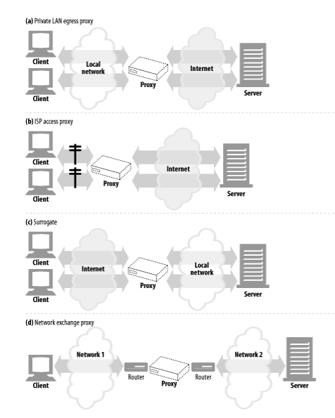
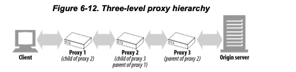
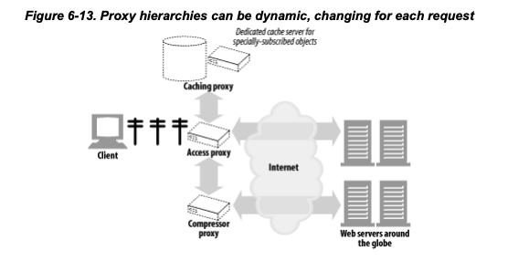

# 프락시

*책이 좀 오래전에 쓰여져서,, 딱딱하고,, 옛스러운 내용이 많은 것 같다,, 요즘의 프락시에 대해서는 따로 알아봐야겠다.*  

[부하분산](../성공과%20실패를%20결정하는%201%25의%20네트워크%20원리/부하분산.md) 여기에 프락시에 대해서 조금 더 정리했다. 포워드 리버스 

> 중개자

클라이언트와 서버 사이에 위치하여 그들 사이의 HTTP 메시지를 정리하는 중개인처럼 동작한다. 

## 1. 웹 중개자

웹 프락시 서버는 클라이언트의 입장에서 트랜잭션을 수행하는 중개인이다. 웹 프락시가 있다면 클라이언트는 HTTP 서버와 이야기하는 대신 자신의 입장에서 서버와 대화해주는 프락시와 이야기한다. 

HTTP 프락시 서버는 웹 서버이기도 하고 웹 클라이언트이기도 하다. 

- 클라이언트에서 볼 때 서버처럼 동작하면서 요청메시지를 받고 응답 메시지를 돌려줌
- 서버에서 볼 때 클라이언트처럼 동작하며 웹 요청 메시지를 보내고 웹 응답 메시지를 받음

### 1.1 개인 프락시와 공유 프락시

- 공용 프락시
  - 여러 클라이언트가 공유, 함께 사용하는 프락시
  - 대부분이 공용
  - 중앙 집중형 프락시를 관리하면 비용 효율이 높고 쉽다. 
  - 캐시 프락시의 경우 많은 사용자의 공통된 요청에서 이득을 취하기 때문에 프락시를 이용하는 사용자가 많을수록 유리하다. 
- 개인 프락시
  - 하나의 클라이언트가 독점적으로 사용

### 1.2 프락시 vs 게이트웨이

*엄밀히 말하면*

- 프락시 
  - 같은 프로토콜을 사용하는 둘 이상의 애플리케이션을 연결
- 게이트웨이
  - 서로 다른 프로토콜을 사용하는 둘 이상을 연결
  - HTTP <-> POP 이메일 서버 

*실질적으로는* 모호하다.

- SSL 보안, Socks 방화벽, FTP 등 약간의 프로토콜을 변환하며 사용 프락시서버는 게이트웨이 기능을 구현하기도 한다. 

## 2. 왜 프락시를 사용하는가 ?

> 보안 개선, 성능 높이기, 비용 절약, 모든 HTTP 트래픽 들여다보기 *( s모 회사의 프록시 지옥이라고 들어보았는감.. )*

프락시는 부가적인 가치를 주는 여러 유용한 웹 서비스를 구현하기 위해 트래픽을 감시하고 수정할 수 있다. 

- 어린이 필터
  - 교유 사이트를 제공하며 성인 콘첸츠 차단하는 필터링 프락시 사용 
  - 부적절한 사이트에 접근하는 것을 강제로 거부 
- 문서 접근 제어자
  - 많은 웹 서버들과 웹 리소스에 대한 단일한 접근 제어 전략 구현, 감사 추적
  - 접근제어를 수시로 갱신할 피룡 없이 중앙 프락시 서버에서 한번에 설정
    - 한번에 안하면 갖고있는 웹서버에서 다 일일이 서버마다 설정해주어야함 
    - 결론적으로 웹 서버가 고정적으로 프락시 서버로부터의 요청만 받아들이도록 설정됨
  - 예시
    - 비밀 재무 데이터에 접근하기 전에 비밀번호 요구 
- 보안 방화벽
  - 보안을 강화하기 위해 프락시 사용 
  - 조직안에 들어오거나 나가는 응용 레벨 프로토콜의 흐름을 네트워크 한 지점에서 통제
  - 트래픽을 세심히 살펴볼 수 있는 후크(hook) 제공
    - *예를들어 . . 사내 <-> 프록시 <-> 외부 거칠때 https도 다시 열어서 사내 crt 인증서로 암호화함* 
- 웹 캐시
  - 프락시 캐시는 인기있는 문서의 로컬 사본을 관리하고 해당 문서에 대한 요청이 오면 빠르게 제공하며, 느리고 비싼 인터넷 커뮤니케이션을 줄인다. 
  - *어쨌든 네트워크 통신 자체가 지역이 멀어지면 응답시간이 느려질 수 밖에 없다. 가까운 지역에 캐싱 프락시를 두면 더 빠르게 응답할 수 있을 것*
- 대리 프락시(reverse proxy *- 역의, 이런 의미보단 배후에 있는 프락시라는 의미*)
  - **웹 서버인것 처럼 위장해서 진짜 웹 서버 요청을 받지**만 요청받은 컨텐츠의 위치를 찾아내기 위해 다른 서버와 커뮤니케이션을 한다. 
  - 공용 콘텐츠에 대한 느린 웹서버의 생능 개선에도 사용 
    - 서버 가속기
  - 콘텐츠 라우팅 기능으로 분산 네트워크 만들기에 사용
  - *로드밸런싱, 보안, 전용선으로 리다이렉션 등,,*
- 콘텐츠 라우터 
  - 인터넷 트래픽 조건과 종류에 따라 요청을 특정 웹서버로 유도하는 콘텐츠 라우터로 동작
  - 더 높은 성능을 위해 비용을 지불했다면 요청을 가까운 복제 캐시로 전달해 빠르게 응답 
  - 필터링 서비스에 가입했다면 HTTP 요청이 필터링 프락시를 통과하도록 함 
  - *자주 안바뀌지만 큰 데이터 가까운 서버에 캐시* 
    - *요즘에 react 같은거도 안에는 바뀌지만 뼈대는 자주 안바뀌니까 react 정적 페이지 캐시해둠*
      - *요청을 다 처리하는것도 중요하지만 첫 페이지가 로딩되는게 사용자 경험에 민감하므로 빠르게 처리* 
    - *CDN(Content Delivery Network)* 
- 트랜스 코더
  - 본문 포맷 수정
    - 예 ) 유튜브 화질 전환 1080 720 480 
  - 데이터 표현방식을 자연스럽게 변환하는 것을 트랜스코딩이라고 한다. 
  - 예시
    - 크기 조정 ) 거쳐가는 GIF 이미지 -> JPG 변환
    - 이미지 TV 디스플레이에 맞게 강도 변환
    - 테스트파일 압축
    - 작은 무선 기기를 위해 이미지를 없애고 단순한 텍스트로 변환
    - 외국어 문서 변환 
- 익명화 프락시(Anonymizer)
  - HTTP 메시지에서 신원을 식별할 수 있는 특성들( 예: 클라이언트, IP주소, From헤더, Referer헤더, 쿠키, URI세션아이디) 적극 제거하여 개인정보 보호와 익명성 보장에 기여 
    - User-Agent헤더에서 사용자 컴퓨터, OS정보 제거
    - From(이메일 주소) 헤더제거
    - Referer헤더 제거
    - Cookie 헤더 제거
  - *정보 보호와 브라우징 경험의 트레이드오프,,*

## 3. 프락시는 어디에 있는가?

> 어떻게 프락시가 네트워크에 배치되는가
>
> 어떻게 프락시의 연쇄가 계층을 이루는가

. 

### 3.1 프락시 서버 배치

**출구(Egress) 프락시**

- 로컬 네트워크와 더 큰 네트워크 사이를 오가는 트래픽을 제어하기 위해 프락시를 **로컬 네트워크의 출구**에 박아 넣을 수 있다. 
- 회사 밖의 악의적인 해커를 막는 방화벽 제공, 혹은 인터넷 요금 절약, 인터넷 성능 개선 , 어린이 필터 

> Egress, k8s ACL 관련
>
> 망분리된 금융서버가 있다고 하면 외부에서 쉽게 접근하지 못하도록 ACL(whitelist) 을 설정해서 허용된 IP만 접근하도록 할 수 있다. 
> 그런데 서버가 다시 배포됐을때 IP가 바뀐다면 그 IP에 대해서 다 처리해주는것도 일임 .
> Egress Proxy 띄워서 Proxy IP를 ACL에 등록하고 우리는 Egress Proxy로 요청을 보내면 사용중인 서버의 IP가 바뀌어도 망에 접속하는데 문제없어짐 

**접근(입구) 프락시**

- 고객으로 부터 모든 요청을 종합적으로 처리하기 위해 프락시는 ISP 접근 지점에 위치하기도 한다. 
- ISP는 사용자들의 다운로드 속도를 개선하고 인터넷 대역폭 비용을 줄이기 위해 캐시 프락시를 사용해 많이 찾는 문서들의 사본을 저장한다.

> ISP : Internet Service Provider
>
> LG, KT, SKT, , 이런 통신 사업자들을 말하는거 .
> 예를들면 유튜브, 넷플릭스 대용량 동영상을 일일이 패킷으로 나눠서 요청응답하면서 스트리밍하면 버퍼링 오져서 우리 아무도 안볼거임
> 이런 ISP랑 계약해서 캐시프록시서버를 만들어 미리 동영상을 저장해두고 제공해주면 빠르게 할 수 있음. 이걸로 갑질논란 있었음 ㅋ ㅋ
>
> 그리고 외국에서 넘어오는 네트워크 다른 망 쓰면 그 나라에 돈 내야하는거 있는데 미리 캐시서버에 저장해두면 다른 망 쓰는거 없기도함 

  
 OTT 캐시서버 관련 기사 보기 

   케이티(KT) 망에 붙여놓은 ‘캐시서버’(많이 이용되는 콘텐츠를 미리 가입자들 근처에 가져다놓는 방식으로 이용 속도를 높이기 위해 운영되는 서버)를 이용하게 하던 에스케이텔레콤(SKT)·에스케이브로드밴드·엘지유플러스(LGU+) 가입자들의 이용 경로를 홍콩·일본 인터넷 사업자 망에 연결된 캐시서버를 이용하도록 변경했다.

그런데 이들 통신사의 국제회선 용량이, 페이스북의 경로 변경으로 갑자기 늘어난 트래픽(망을 오가는 데이터량)을 소화하지 못하면서 가입자들이 콘텐츠 이용에 불편을 겪는 상황이 발생했다. 이에 방통위는 갑작스러운 경로 변경으로 이용자 불편을 초래한 책임을 물어 페이스북에 시정명령과 함께 3억9600만원의 과징금을 부과했다. 하지만 페이스북은 방통위 징계에 불복해 소송을 제기했고, 1심에서 승소한 상태다.

유튜브 초기에는 국내 인터넷 가입자들도 미국 등 국외에 있는 유튜브 서버를 이용했다. 유튜브가 인기를 끌면서 국내 인터넷 사업자와 유튜브 서버 사이의 국제회선에 트래픽이 급증했고, 인터넷 사업자들의 국제회선 증설이 이를 따르지 못하면서 이용자들은 수시로 버퍼링(콘텐츠 데이터를 미처 받지 못해 화면이 잠시 정지되는 상태) 현상을 경험해야 했다. 인터넷 사업자 쪽에는 가입자들의 불만과 이탈 으름장이 쏟아졌고, 사업자들은 국제회선 증설에 매달릴 수밖에 없었다.

<u>이런 처지의 통신사들에게 구글이 내민 ‘당근’이 캐시서버 설치였다.</u> 한 통신사 관계자는 “구글 쪽이 ‘유튜브 이용은 앞으로 계속 빠르게 늘텐데, 국제회선 증설과 이용자 이탈 걱정으로 힘을 뺄래? 아니면 캐시서버 설치·운영 비용 부담을 질래?’라고 하는 전략을 펴니 어쩌겠냐”고 당시 답답했던 상황을 전했다. 구글은 각 나라별로 이용자의 유튜브 영상 이용 속도를 기준으로 인터넷 사업자 통신망 품질 순위를 매겨 이용자들에게 공개하기도 했다.

통신사들은 구글을 사실상 무임 승차시키는 것으로 상황은 넘겼다고 생각했지만 착각이었다. 첫 단추를 잘못 끼운 대가가 갈수록 혹독해지고 있다. 페이스북과 넷플릭스 등 후발 글로벌 콘텐츠 사업자들도 줄줄이 구글처럼 통신망 무임 승차를 허용해줄 것을 요구하고 있다. 드라마·영화 등을 인터넷으로 보게 하는 오티티(OTT) 시장이 커지면서 이런 악순환은 앞으로 더욱 심해질 가능성이 크다.

  출처  - https://www.hani.co.kr/arti/economy/it/919671.html

**대리 프락시**

- 네트워크의 가장 끝에있는 웹 서버들의 바로 앞에 위치하여 웹 서버로 향하는 모든 요청을 처리하고 필요할 때만 웹서버에게 자원을 요청
- 보안기능 추가, 빠른 웹 서버 캐시를 느린 웹서버 앞에 놓음으로 성능 개선 
- 대리 프락시는 일반적으로 웹서버의 이름과 IP주소로 스스로를 가장하여 모든 요청은 이 프락시로 간다.

**네트워크 교환 프락시**

- 캐시를 이용해 인터넷 교차로의 혼잡을 완화하고 트래픽 흐름을 감시하기 위해 충분한 처리능력을 갖춘 프락시가 네트워크 사이의 인터넷 피어링 교환 지점들에 놓인다. 

### 3.2 프락시 계층

프락시는 연쇄적으로 구성할 수 있다. 최종적으로 원 서버에 도착할 때 까지 프락시와 프락시를 거쳐 이동한다.   

인바운드(원 서버)와 가까운 쪽이 상대적으로 부모 프락시이다.   

  . 

  

**프락시 계층 콘텐츠 라우팅**

프락시 계층이 반드시 정적이어야 하는 것은 아니다. 여러가지 판단 근거에 의해 메시지를 다양하고 유동적인 프락시 서버와 원 서버들의 집합에게 보낼 수 있다.   

- 요청된 객체가 콘텐츠 분산을 위해 돈을 지불했다면 프락시는 요청을 가까운 캐시서버에게 보낸다.
- 요청이 특정 이미지에 대한 것일 경우 이미지를 압축하여 클라이언트가 빠르게 다운로드할 수 있게 한다. 

- 동적 부모 선택의 몇가지 예
  - 부하 균형 (로드 밸런싱)
    - 현재 부모 서버들의 작업량 수준에 근거하여 부모 프락시를 고른다. 
  - 지리적 인접성에 근거한 라우팅
    - 자식 프락시는 원 서버의 지역을 담당하는 부모를 선택
  - 프로토콜/타입 라우팅
    - URI에 근거하여 다른 부모나 원 서버로 라우팅
    - 특별한 프로토콜로 처리될 수도 있음
  - 유료 서비스 가입자를 위한 라우팅
    - 웹 서비스 운영자가 빠른 서비스를 위해 추가금을 지불했다면 URI는 대형 캐시나 성능 개선을 위한 압축 엔진으로 라우팅 될 수 있다. 

이러한 동적 부모 라우팅은 제품(설정 파일, 스크립트 언어, 동적으로 실행 가능한 플러그인)마다 다르게 구현된다.

### 3.3 어떻게 프락시가 트래픽을 처리하는가

**클라이언트를 수정** ( s 모 회사 . . 도 이런 방식인듯)

- 구글 크롬, 마이크로 소프트 브라우저 포함 웹 클라이언트 수동 혹은 자동 프락시 설정 지원

**네트워크를 수정**

- 클라이언트는 모르는 상태에서 **네트워크 인프라를 가로채서** 웹 트래픽을 조정
- 스위칭 장치, 라우팅 장치 필요 (인터셉트 프락시)
  - 사용자는 존재한다는 것 조차 눈치채지 못함 

**DNS이름공간 수정**

- 웹 서버 앞에 위치하는 프락시서버인 대리 프락시는 웹 서버의 이름과 IP주소를 자신이 직접 사용한다. 
- 모든 요청은 서버 대신 대리 프락시로 간다. 
- *ALB도 일종의 이것*

**웹 서버 수정**

- HTTP 리다이렉션 305를 클라이언트에게 돌려줌으로써 클라이언트의 요청을 **프락시로 리다이렉트 하도록** 설정

## 4. 클라이언트 프락시 설정

*이부분은 살짝 넘김*

- 수동 설정 
  - 프록시설정변경,, 익스프로러 인터넷 옵션에서 설정,, 
  - *회사에서 쓰는게 이 방식인거 같기도...*
- 브라우저 기본 설정
- 프락시 자동 설정 PAC - 자바스크립트
- WPAD 프락시 발견

## 5. 프락시 요청의 미묘한 특징들

*이거도 좀 옛스러운.. 느낌이라 ..* 

### 5.1 프락시 URI 서버는 URI와 다르다

- 웹 서버 요청 보낼때는 URI만 보내고 헤더 Host에 주소를 보내는데 프락시로 보낼때는 완전한 URI로 보내야한다. 

### 5.2 가상 호스팅에서 일어나는 문제

- 요청된 메시지가 완전한 URI를 갖도록 한다.
- Host헤더를 요구한다.

### 5.3 인터셉트 프락시는 부분 URI를 받는다.

- 클라이언트는 서버로 보내는걸로 알고 있기 때문에 완전한 URI로 보내지 않음. 

### 5.4 프락시는 프락시 요청과 서버 요청을 모두 다룰 수 있다.

- 요청 메시지의 완전한 URI, 부분 URI 모두 지원해야한다.
- 완전한 URI 주어졌다면 사용
- 부분 URI + Host 헤더
- 부분 URI 
  - 리버스 프락시라면 원 서버 정보를 이미 알고 있을 것
  - 인터셉트 프락시의 이전 기록을 보고 찾음
  - 해결할 수 없을 경우클라이언트에게 에러로 응답 올바른 요청을 보내달라고 반환함 

### 5.5 전송중 URI 변경

프락시 서버는 요청 URI 변경(변경을 안하는 것)에 매우 신경을 써야한다.

- 포트번호를 80으로 변경하거나, 이스케이프 문자로 교체하는것이 무해해보여도 상호운용성 문제를 일으킬 수 있다.
- HTTP 명세는 인터셉터 프라시가 URI를 전달할 때 절대경로를 고쳐쓰는것을 특히 금지한다. 
- 프락시 서버는 가능한 관대하도록 애써야한다. 

### 5.6 URI 클라이언트 자동 확장과 호스트명 분석

### 5.7 프락시 없는 URI 분석 

### 5.8 명시적인 프락시를 사용할 때의 URI 분석

### 5.9 인터셉트 프락시를 이용한 URI 분석

## 6. 메시지 추적

> via, trace 관련인데 요즘은 클라우드 인프라를 쓰기도 하고 자신의 인프라 구조를 노출하는 것을 모두 꺼리기 때문에 
> 헤더를 통해서 이런 정보를 다 기록하는것의 목적?필요가 좀 애매한 것 같음

### 6.1 Via 헤더

Via 헤더 필드는 메시지가 지나는 각 중간 노드(프락시나 게이트웨이)의 정보를 나열한다. 메시지가 또 다른 노드를 지날 때 마다 중간 노드는 Via 목록의 끝에 반드시 추가되어야 한다.  

- 클라이언트 -> A -> B -> C -> 서버 를 지나간다면 
  - 요청 Via 헤더는 via 1.1A, 1.1B, 1.1C
  - 응답 헤더는 via 1.1C, 1.1B, 1.1A
- 요청과 응답이 갈때와 올때 역순일 것

- 게이트웨이를 지날 때도 기록
- 문자열 안에 정확한 호스트명이 들어가지 않도록 숨길수도 있음

### 6.2 TRACE 메서드

> via, trace보단 
>
> https://www.lesstif.com/software-architect/proxy-client-ip-x-forwarded-for-xff-http-header-20775886.html
>
> 이런 글을 보는게 나을 것 같다.
>
> 요즘엔 x-forwarded-for에 저장한다고 하고 웹서버마다 log format을 그래서 변경해주고, 옵션으로 처리도 해주어야한다고 한다.
>
> **보통 getRemoteAddr로 클라이언트의 정보를 얻고싶은데 앞에 프록시가 끼면 프록시의 정보가 얻어와지므로 via, trace, XFF 헤더등으로 판별하여 클라이언트의 정보를 얻음 => 이 개념을 알아두면 될 것 같다.** 

## 8. 프락시 상호 운용성

 ### 8.1 지원하지 않는 헤더와 메서드 다루기

프락시는 이해할 수 없는 헤더 필드는 반드시 그대로 전달해야하며 같은 이름의 필드가 여러개 있는 경우에는 그들의 상대적인 순서도 반드시 유지해야한다. 

### 8.2 OPTIONS: 어떤 기능을 지원하는지 알아보기

OPTIONS 메서드는 서버나 웹서버의 특정 리소스가 어떤 기능을 지원하는지 클라이언트가 알아볼 수 있게 해준다. 

서로 다른 기능 수준의 서버와 프락시가 더 쉽게 상호작용할 수 있도록 클라이언트는 OPTIONS를 이용해 서버의 능력을 먼저 알아낼 수 있다.

### 8.3 Allow 헤더

Allow 엔티티 헤더 필드는 요청 URI에 의해 식별되는 자원에 대해 지원되는 메서드들이나 서버가 지원하는 모든 메서드를 열거한다.   

Allow는 지원했으면 하는 메서드를 추천하기 위해 요청 헤더로 사용될 수도 있다. - 이를 모두 지원해야할 의무는 없고 그 요청으로 실제로 지원하는 메서드를 열거하는 Allow 헤더를 포함해야한다.   

만약 프락시가 지정된 메서드를 이해할 수 없다고 해도 프락시는 Allow 헤더 필드를 수정할 수 없다.  

---

추가 내용   

Options , Allow는 CORS 관련으로 사용됨

## CORS

교차 출처 리소스 공유 - 한 출처에서 실행중인 웹 애플리케이션이 다른 출처의 선택한 자원에 접근할 수 있는 권한을 부여하도록 브라우저에 알려주는 체제   

Preflight방법으로 Options 메소드로 서버에 지원하는 origin, header, 메서드를 확인하고 자신이 그 origin에 해당하면 서버에게 요청을 보낸다.  

**프록시를 이용한 인증**

서비스 만들때마다 로그인 체크 로직 , 인증 다 코드에 넣기 힘드니깐 프록시에서 처리하고 프록시에서 헤더에 x-token-..이런식으로 넣어줄 수도 있다.  