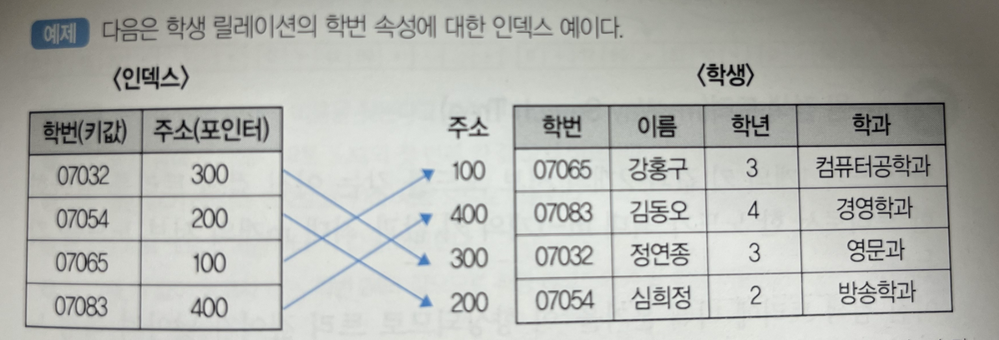

# 인덱스

인덱스는 데이터 레코드(튜플)에 빠르게 접근하기 위해 `<키 값, 포인터>` 쌍으로 구성되는 자료구조이다. 

테이블의 특정 컬럼에 인덱스를 생성하면 , 해당 컬럼의 데이터를 정렬한 후 별도의 메모리 공간에 데이터의 물리적 주소와 함께 저장된다. 컬럼의 값과 물리적 주소를 (key, value) 한 쌍으로 저장한다.

**예시 )** 

위의 인덱스에서 키 값은 **학번**이고, 포인터는 해당 학번이 저장된 레코드의 물리적인 주소이다. 키 값인 학번이 정렬되어 있기 때문에 인덱스를 통해 레코드를 빠르게 접근할 수 있다. 

## 인덱스의 장점, 특징

인덱스의 특징은 데이터들이 **정렬되어있다** 는 점이다. 이 점이 조건검색이라는 영역에서 장점이 된다. 

1. Where절

- 인덱스가 없으면 특정한 값을 찾기 위해 모든 데이터 페이지를 다 뒤지는 TABLE SCAN(FULL SCAN)이 발생한다. -> **성능 저하**

- 인덱스로 생성한 컬럼을 SELECT문의 WHERE의 조건으로 거는 등의 작업을 하면, 정렬되어있기 때문에 빠르게 찾아낼 수 있다. 

  
 분포도란 ? 

  일반적으로 적용 가능한 인덱스가 없거나 분포도가 넓은 데이터를 검색할 때는 FULL TABLE SCAN을 사용한다. 

- 분포도란 특정 컬럼의 데이터가 테이블에 평균적으로 분포되어있는 정도를 말한다. 
- 분포도가 넓다 : 유니크한 데이터 종류가 많다. 
- 분포도가 10~15% 정도인  컬럼이 인덱스로 적절하다. 
  

2. Order by 절

이미 데이터가 인덱스 키의 컬럼 순으로 정렬되어있기 때문에, order by 쿼리시에 sort 동작이 생략되어 조회 성능을 높일 수 있다. 

3. MIN, MAX 처리 

이것 또한 정렬되어 있기 때문에 시작이나 끝 값만 가져오기에 Full Scan보다 효율적이다. 

## 인덱스의 단점, 관리 방법 

'정렬'이 장점이라면 *정렬된 상태를 계속 유지시켜야 한다는 것* 이 단점이며, 인덱스를 잘못 사용할 경우 오히려 성능저하 , 역효과가 발생할 수 있다.

1. 인덱스를 관리하기 위한 별도의 저장공간이 필요하다 (약 10%)

2. 인덱스 관리를 위한 추가 작업이 필요하다

DML(CREATE, UPDATE, DELETE)를 통해 데이터가 추가되거나 값이 바뀐다면 Index 테이블 내에 있는 값을 다시 정렬해야하고, 인덱스와 원본 테이블 두군데에 데이터를 모두 수정해 줘야한다. 

이에 대한 부하를 최소화 하기 위해, 인덱스는 인덱스는 삭제가 아니라 '사용하지 않음' 처리를 하므로 UPDATE, DELETE가 빈번하게 발생된다면 데이터보다 인덱스의 개수가 더 늘어날 수 있다. 

- INSERT : 새로운 데이터에 대한 인덱스를 추가함
- UPDATE : 기존의 인덱스를 사용하지 않음으로 처리하고, 갱신된 데이터에 대해 인덱스를 추가함
- DELETE : 삭제하는 데이터의 인덱스를 사용하지 않는다는 작업을 진행함.

## 인덱스를 사용하면 좋은 경우

- 규모가 작지 않은 테이블
  - 규모가 작은 테이블은 Full Scan을 해도 충분하다
- INSERT, UPDATE, DELETE가 자주 발생하지 않는 컬럼
- JOIN, WHERE 또는 ORDER BY에 자주 사용되는 컬럼
- 데이터의 중복도가 낮은 컬럼
  - 테이블에 남/여 밖에 없는데 성별을 인덱스로 잡는건 좋지 않을것

조회시 자주 사용하며, 고유한 값 위주로 인덱스를 설정하면 좋다 !

## 인덱스를 고르는 기준

- 카디널리티가 높은 순
  - 카디널리티 : 해당 컬럼의 중복된 수치 (중복도 ⬆️ 카디널리티 ⬇️ )
  - 성별, 학년은 카디널리티가 낮다. 
  - 주민번호, 학번, 계좌번호는 카디널리티가 높다.
- 업데이트가 빈번하지 않은 **컬럼**
  - 컬럼순으로 계속 정렬해야하기 때문

- 기본키를 위한 인덱스를 `기본 인덱스`라고 하고, 기본 인덱스가 아닌 인덱스들을 `보조 인덱스`라고 한다. 대부분의 RDBMS에서는 모든 기본키에 대해서 자동적으로 기본 인덱스를 생성한다. 
- 레코드의 물리적 순서가 인덱스의 엔트리 순서와 일치하게 유지되도록 구성되는 인덱스를 **클러스터드(Clustered) 인덱스**라고 한다. 
- 대표적인 인덱스 자료구조로는 B-트리, B+-트리 등이 있다. 

- 출처 정보처리기사 실기 책 
- https://coding-factory.tistory.com/746

---
참고 
## 질문

1. DB에서 말고 인덱스를 사용하는 곳이 있는지?

   인덱스는 DB에서 사용하는 자료구조이고, 일상생활에서 비슷하게 쓰이는 것은 책의 목차,색인이 있다.

2. 중복되는 데이터들이 인덱스테이블에 모두 들어가는지? ㅇㅇ 
    http://saphelp.ucc.ovgu.de/NW750/EN/cf/21eb20446011d189700000e8322d00/content.htm