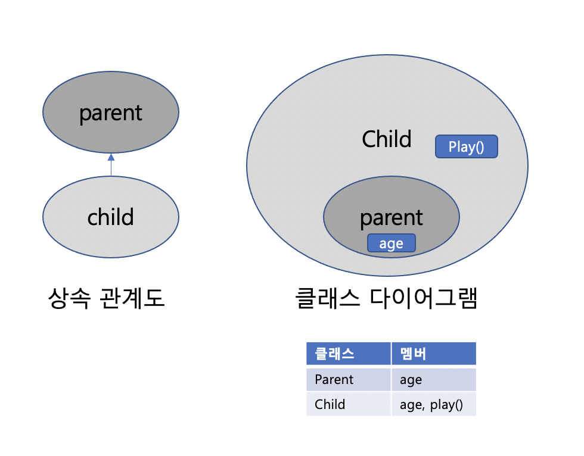
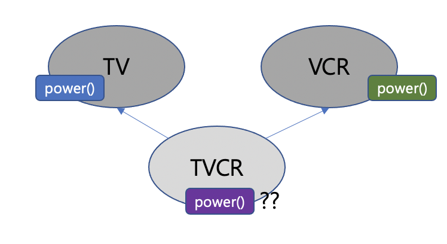

# 객체지향 프로그래밍 - 상속

- 내용 출처 자바의정석 3 (남궁성, 도우출판 )


## 상속

상속이란, **기존의 클래스를 재사용하여 새로운 클래스를 작성하는 것**

- 보다 적은양의 코드로 새로운 클래스 작성할 수 있고 코드를 공통적으로 관리할 수 있어 추가 및 변경에 용이하다. 
- 코드의 재사용성을 높이고 코드의 중복을 제거하여 프로그램의 생산성과 유지보수에 크게 기여한다. 


### 사용법 - extends

``` java
class Child extends Parent {
  // ...
}
```

- 상속해주는 클래스 - 조상 클래스, 부모 클래스, 상위 클래스, 기반 클래스
- 상속 받는 클래스 - 자손 클래스 , 자식 크래스, 하위 클래스, 파생된 클래스

<br/>



Parent클래스에 `age`멤버 변수를 추가하면, 자손 클래스는 조상의 멤버를 모두 상속받기 때문에 자동적으로 Child클래스에 `age`라는 멤버변수가 추가된다.    

자손인 Child 클래스에 새로운 멤버로 `play()`메서드를 추가해도 Parent클래스는 아무 영향 받지 않는다. *조상 클래스가 변경되면 자손 클래스는 영향을 받짖만, 자손 클래스가 변경되는 것은 조상 클래스에 영향을 주지 않는다.* 

- 생성자와 초기화 블럭은 상속되지 않는다. 멤버만 상속된다.
- 자손 클래스의 멤버 개수는 조상 클래스보다 항상 같거나 많다. 


### 예제 1

```java
package com.dev.studylog.Java.inheritance;

class Tv {
    boolean power;
    int channel;

    void power() {
        power = !power;
    }
    void channelUp() {
        ++channel;
    }
    void channelDown(){
        --channel;
    }
}

class CaptionTv extends Tv {
    boolean caption; // 자막  상태 on, off
    void displayCaption(String text) {
        if(caption) {
            System.out.println(text);
        }
    }
}


public class CaptionTvTest {
    public static void main(String[] args) {
        CaptionTv ctv = new CaptionTv();
        ctv.channel = 10;
        ctv.channelUp();
        System.out.println("channel:"+ ctv.channel);
        ctv.displayCaption("hello");
        ctv.caption = true;
        ctv.displayCaption("hello");
    }
}

// result : 
// channel:11
// hello

```


### 클래스 간의 관계 - 포함관계

상속 이외에도 클래스를 재사용하는 방법은, 클래스간에 **포함 관계(Composite)**를 맺어주는 것이다. 이것은 한 클래스의 멤버변수로 다른 클래스 타입의 참조변수를 선언하는 것을 뜻한다. 

```java
class Circle {
  int x;
  int y;
  int r;
}
class Point {
  int x;
  int y;
}
```

Point클래스를 재사용해서 Circle 클래스를 작성한다면

```java
class Circle {
  Point c = new Point();
  int r;
}
```


### 클래스간의 관계 결정하기

클래스를 작성할 때 상속관계를 맺어줄 것인지, 포함 관계를 맺어줄 것인지는 어떻게 결정할 것 인가 =>   **~은 ~이다(`is-a`)와 ~은 ~을 가지고 있다(`has-a`)를 넣어서 문장을 만들어 본다.** 

```
원(Circle)은 점(Point)이다. - Circle is a Point => 상속
원(Circle)은 점(Point)를 가지고 있다 - Circle has a Point => 포함

// 또 다른 예
Car클래스 SportsCar는 Car이다 -> 상속
Deck은 Card를 가지고 있다 => 포함 
```


### 예제 2

```java
package com.dev.studylog.Java.inheritance;

public class DrawShape {

    public static void main(String[] args) {
        Point[] p = {
                new Point(100,100),
                new Point(140,50),
                new Point(200,100),
        };

        Triangle t = new Triangle(p);
        Circle c = new Circle(new Point(150,150), 50);
        t.draw();
        c.draw();
    }
}

class Point {
    int x;
    int y;
    Point( int x, int y) {
        this.x = x;
        this.y = y;
    }
    Point(){
        this(0,0);
    }
    String getPoint(){
        return "("+x+","+y+")";
    }
}

class Shape {
    String color = "black";
    void draw(){
        System.out.println("color = " + color);
    }
}
//원은 도형이다
//원은 좌표를 가지고있다.
class Circle extends Shape {
    Point center; //원점좌표
    int r; //반지름

    Circle(){
        this(new Point(0,0),100);
    }
    Circle(Point center, int r) {
        this.center = center;
        this.r= r;
    }
    void draw() {
        //원을 그리는 대신에 원의 정보를 출력
        System.out.printf("[center=(%d, %d), r=%d, color=%s]\n", center.x, center.y, r, color);
    }
}

class Triangle extends Shape {
    Point[] p = new Point[3];
    Triangle(Point[] p) {
        this.p = p;
    }
    void draw() {
        System.out.printf("[p1 = %s, p2=%s, p3=%s, color=%s]\n", p[0].getPoint(), p[1].getPoint(), p[2].getPoint(), color);
    }
}

// result:
// [p1 = (100,100), p2=(140,50), p3=(200,100), color=black] 
// [center=(150, 150), r=50, color=black]
```


### 단일 상속

- 자바는 오직 단일 상속만을 허용한다.
- 둘 이상의 클래스로 부터 상속받을 수 없다. 
  - 클래스 간 관계가 복잡해지고 서로 다른 클래스로 부터 상속받은 멤버간의 이름이 같은 경우 구별할 수 있는 방법이 없다 (다이아몬드 문제)
  - 

### Object 클래스 - 모든 클래스의 조상

다른 클래스로부터 상속받지 않는 모든 클래스들은 자동적으로 Object클래스로부터 상속받게 한다. 

- `toString()`, `eqauls(Object o)` 와 같은 메서드는 Object에 정의된 것들이다. -> java.lang패키지의 유용한 클래스 참고 

