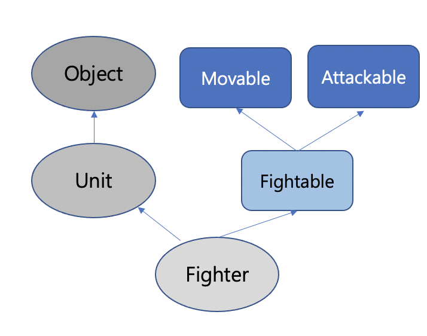
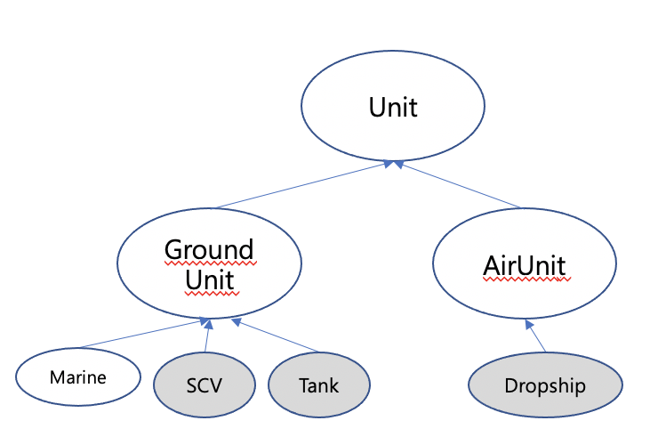
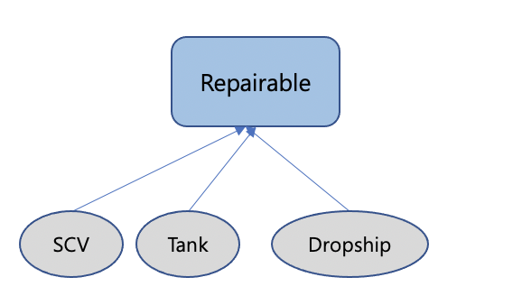

# 객체지향 프로그래밍 - 인터페이스

- 내용 출처 자바의정석 3 (남궁성, 도우출판 )

## 인터페이스 (interface)

**오직 추상 메서드와 상수만을 멤버로 가지 수 있는 추상 클래스**  

일종의 추상클래스로, 추상클래스 처럼 추상메서드를 갖지만 추상클래스보다 추상화 정도가 높아서 추상클래스와 달리 몸통을 갖춘 일반 메서드 또는 멤버변수를 구성원으로 가질 수 없다. 추상 클래스를 "미완성 설계도"라고 한다면 인터페이스는 밑그림만 그려져있는 "기본 설계도"이다. 

### 인터페이스의 작성

키워드로 `class` 대신 `interface`를 사용한다. 

```java
interface 인터페이스이름 {
  public static final 타입 상수이름 = 값;
  public abstract 반환타입 메서드이름(매개변수 목록);
}
```

- 모든 멤버 변수는 `public static final`이어야 하며, 이를 생략할 수 있다.

- 모든 메서드는 `public abstract`이어야 하며, 이를 생략할 수 있다. 

  - 예외 : jdk8부터 static, default메서드의 추가를 허용한다 

    

### 인터페이스의 상속

인터페이스는 인터페이스로부터만 상속받을 수 있으며, **클래스와 달리 다중 상속이 가능하다.** 

```java
interface Movable {
  void move(int x, int y);
}
interface Attackable {
  void attack(Unit u);
}
interface Fightable extends Movable, Attackable {}
```

Figthable 자체에 정의된 멤버가 하나도 없지만 조상 인터페이스로부터 상속받은 두개의 추상메서드 move, attack을 멤버로 갖게된다.  


### 인터페이스의 구현

인터페이스도 추상클래스처럼 그 자체로는 인스턴스를 생성할 수 없다. `implements` 키워드를 사용해서 구현 클래스를 정의한다.

```java
class 클래스이름 implements 인터페이스이름 {
  // 인터페이스에 정의된 추상메서드 구현 
}
class Figther implements Fightable {
  public void move(int x, int y) {
    // 구현
  }
  public void attack(Unit u) {
    // 구현 
  }
}
```

<br/>

인터페이스 메서드중 일부만 구현한다면 abstract를 붙여서 추상 클래스로 선언해야하고, 상속과 구현을 동시에 할 수도 있다. 

```java
abstract class Fighter implements Fightable {
  publi void move (int x, int y) {
    //
  }
}

class Fighter extends Unit implements Fightable {
  public void move(int x, int y) {
    // 구현
  }
  public void attack(Unit u) {
    // 구현 
  }
}
```

```java
package com.dev.studylog.Java.interfaceTest;

public class FighterTest {
    public static void main(String[] args) {
        Fighter f = new Fighter();
        if ( f instanceof Unit){
            System.out.println("unit의 자손");
        }
        if(f instanceof Fightable) {
            System.out.println("fightable 인터페이스 구현");
        }
        if(f instanceof Movable) {
            System.out.println("movable 인터페이스 구현");
        }
        if(f instanceof Attackable) {
            System.out.println("attackable 인터페이스 구현");
        }
        if( f instanceof Object) {
            System.out.println("Object클래스의 자손 ");
        }
    }
}

class Fighter extends Unit implements Fightable {
    public void move(int x, int y) {
        System.out.println("move");
    }
    public void attack(Unit u) {
        System.out.println("attack");
    }
}
class Unit {
    int currentHP;
    int x;
    int y;
}
interface Fightable extends Movable, Attackable {}

interface  Movable {
    void move(int x, int y);
}
interface  Attackable {
    void attack(Unit u);
}

```

<br/>

  


### 인터페이스를 이용한 다중 상속

자바에서는 다중 상속을 허용하지 않는다. 인터페이스를 이용하면 다중상속이 가능하긴 하지만 인터페이스가 다중상속만을 위한 것은 아니다.   

인터페이스는 static 상수만 정의할 수 있으므로 조상 클래스의 멤버변수와 충돌하는 경우는 거의 없고, 충돌한다 하더라도 클래스 이름을 붙여 구분이 가능하다. 또한 추상메서드는 구현이 전혀 없으므로 조상 클래스와 선언부가 일치하면 조상 메서드를 상속받으면 되므로 문제되지 않는다.   

하지만 이렇게하면 상속받는 멤버의 충돌은 피할 수 있지만 다중상속의 장점을 잃게된다. 두개의 클래스로부터 상속을 받아야 할 상황이라면 두 조상 클래스 중에서 비중이 높은 쪽을 선택하고 다른 한쪽은 클래스 내부에 멤버로 포함하는 방식으로 처리하거나, 다른 필요한 부분을 뽑아서 인터페이스로 만든다음 구현하도록 한다. 


### 인터페이스를 이용한 다형성

인터페이스 타입의 참조변수로 이를 구현한 클래스의 인스턴스를 참조할 수 있고, 형변환도 가능하다.

```java
Fightable f = new Figheter();
```

인터페이스는 메서드의 매개변수 타입으로 사용될 수 있다. 이 의미는 **메서드 호출 시 해당 인터페이스를 구현한 클래스의 인스턴스를 매개변수로 제공해야한다는 것이다.** 

```java
void attack(Fightable f) {
  //..
}
class Figheter extends Unit implements Fightable {
  public void move(int x, int y) { /**/ }
  public void attack(Fightable f) {/**/}
}
```

그리고 메서드의 리턴타입으로 인터페이스의 타입을 지정하는 것 여시 가능하다. **리턴타입이 인터페이스라는 것은 메서드가 해당 인터페이스를 구현한 클래스의 인스턴스를 반환한다는 것을 의미한다.**  

```java
Fightable method() {
  //...
  Fighter f = new Fighter();
  return f;
}
```


### 예제 

```java
public class ParserTest {
    public static void main(String[] args) {
        Parseable parser = ParserManager.getParser("XML");
        parser.parse("document.xml");
        parser = ParserManager.getParser("HTML");
        parser.parse("document2.html");
    }
}

interface Parseable {
    //구문 분석 작업 수행
    public abstract void parse(String fileName);
}

class ParserManager {
    public static Parseable getParser(String type) {
        if(type.equals("XML")){
            return new XMLParser();
        } else {
            Parseable p = new HTMLParser();
            return p;
        }
    }
}

class XMLParser implements Parseable {
    public void parse(String fileName) {
        System.out.println(fileName+"- xml parsing completed.");
    }
}
class HTMLParser implements Parseable{
    public void parse(String fileName) {
        System.out.println(fileName+"- html parsing completed");
    }
}

// document.xml- xml parsing completed.
// document2.html- html parsing completed
```

나중에 새로운 구문분석기가 나와도 ParserTest를 변경할 필요 없이 Manager클래스의 getParser메서드에서 변경하면 된다. 


## 인터페이스의 장점

- 개발 시간 단축
- 표준화 가능
- 서로 관계없는 클래스들에게 관계를 맺어줄 수 있다.
- 독립적인 프로그래밍이 가능하다.


### 개발시간을 단축시킬 수 있다.

인터페이스가 작성되면, 이를 사용해서 프로그램을 작성하는 것이 가능하다. **메서드를 호출하는 쪽에서는 메서드의 내용과 관계없이 선언부만 알면 되기 때문이다.**   

동시에 다른 한 쪽에서는 인터페이스를 구현하는 클래스를 작성하게하면 인터페이스를 구현하는 클래스가 작성될 때까지 기다리지 않고도 양쪽에서 동시에 개발을 진행할 수 있다.   

### 표준화가 가능하다.

프로젝트에 사용되는 기본 틀을 인터페이스로 작성한다음, 개발자들에게 인터페이스를 구현하여 프로그램을 작성하도록 함으로써 보다 일관되고 정형화된 프로그램 개발이 가능하다.

### 서로 관계없는 클래스들에게 관계를 맺어 줄 수 있다.

상속관계에 있지 않은 서로 아무 관계 없는 클래스를 하나의 인터페이스를 공통적으로 구현하도록 함으로써 관계를 맺어 줄 수 있다.

### 독립적인 프로그래밍이 가능하다.

**인터페이스를 이용하면 클래스의 선언과 구현을 분리시킬 수 있기 때문에 실제 구현에 독립적인 프로그램을 작성하는것이 가능하다.** 클래스와 클래스 간의 직접적인 관계를 인터페이스를 이용해 간접적인 관계로 변경하면, 한 클래스의 변경이 다른 클래스에 영향을 미치지 않은 독립적인 프로그래밍이 가능하다.   

> 특정 DB를 사용하다가 다른 종류의 DB를 사용하기 위해서 전체 프로그램에서 데이터베이스과 관련된 코드를 모두 변경해야한다.   
>
> 데이터베이스 관련 인터페이스를 정의하고 이를 이용해서 프로그램을 작성하면 데이터베이스 종류가 변경되더라도 프로그램을 변경하지 않도로 할 수 있다. 

### 인터페이스 구현 예제 - 게임 

  

SCV(건설 인부)에게 Tank, Dropship같은 기계화 유닛을 수리할 수 있는 기능을 제공하기 위해 repair 메서드를 정의한다면 다음과 같을 것이다. 

```java
void repair(Tank t) {
  //Tank 수리
}
void repair(Dropship d) {
  //Dropship 수리
}

//.. 수리가 가능한 유닛의 개수만큼 오버로딩된 메서드를 정의해야한다. 
```

중복된 repair메서드를 피하기 위해 매개변수 타입을 공통조상으로 하면 좋겠지만 Dropship과 Tank는 공통조상이 다르기 때문에 공통조상의 타입으로 메서드를 정의한다해도 최소 2개의 메서드(GroundUnit, AirUnit)이 필요할 것이다. 또한 GroundUnit에는 기계화 유닛이 아닌 Marine과 같은 클래스도 포함될 수 있기 때문에 repair메서드에 GroundUnit을 넣는것은 부적합하다.   

현재의 상속 관계에서 이들의 공통점은 없다. **이 때 인터페이스를 이용하면 기존의 상속체계를 유지하면서 기계화 유닛에 공통점을 부여할 수 있다.**   

```java
interface Repairable {}
class SCV extends GroundUnit implements Repairable {
//..
}
class Tank extends GroundUnit implements Repairable {
//..
}
class Dropship extends AirUnit implements Repairable {
//..
}

```

  

Repairable은 정의된 것은 없고 단지 인스턴스의 타입 체크에 사용될 뿐이다. repair메서드의 매개변수 타입을 Repairable로 선언하면 이 메서드의 매개변수로 Repairable 인터페이스를 구현한 클래스의 인스턴스만 받아들여질 것이다. 

```java
void repair(Repairable r) {
  //매개변수로 넘겨받은 유닛을 수리한다. 
}
```

앞으로 새로운 클래스가 추가될 때 SCV의 repair 메서드에 의해서 수리가 가능하도록 하려면 Repairable인터페이스를 구현하도록 하면 될 것이다. 


<details>
  <summary> 코드 보기 </summary>

 ```java
  
  package com.dev.studylog.Java.interfaceTest;

public class RepairableTest {
    public static void main(String[] args) {
        Tank tank = new Tank();
        Dropship dropship = new Dropship();
        Marine marine = new Marine();
        SCV scv = new SCV();
        scv.repair(tank);
        scv.repair(dropship);
        // scv.repair(marine); error -> no repairable 
    }
}

interface Repairable {}

class GameUnit {
    int hitPoint;
    final int MAX_HP;
    GameUnit(int hp) {
        MAX_HP = hp;
    }
    // ...
}

class GroundUnit extends GameUnit {
    GroundUnit(int hp) {
        super(hp);
    }
}

class AirUnit extends GameUnit {
    AirUnit(int hp) {
        super(hp);
    }
}

class Tank extends GroundUnit implements Repairable {
    Tank() {
        super(150);
        hitPoint = MAX_HP;
    }
    public String toString(){
        return "Tank";
    }
}

class Dropship extends AirUnit implements Repairable {
    Dropship() {
        super(125);
        hitPoint = MAX_HP;
    }
    public String toString(){
        return "Dropship";
    }
}

class Marine extends GroundUnit {
    Marine() {
        super(40);
        hitPoint = MAX_HP;
    }
}

class SCV extends AirUnit implements Repairable {
    SCV () {
        super(60);
        hitPoint = MAX_HP;
    }
    void repair(Repairable r){
        if( r instanceof GameUnit) {
            GameUnit u = (GameUnit) r;
            while(u.hitPoint !=u.MAX_HP) {
                u.hitPoint++;
            }
            System.out.println(u.toString()+"의 수리가 끝났습니다.");
        }
    }
}
 ```

</details>

### 인터페이스의 이해

```
- 클래스를 사용하는 쪽(User)과 클래스를 제공하는 쪽(Provider)이 있다.
- 메서드를 사용(호출)하는 쪽(User)에서는 사용하려는 메서드(Provider)의 선언부만 알면 된다.(내용을 몰라도 된다. )
```


**상황 1 **

```java
class A {
  public void methodA(B b) {
    b.methodB();
  }
}
class B {
  public void methodB(){
    System.out.println("methodB()");
  }
}
class InterfaceTest {
  public static void main(String args[]){
    A a = new A();
    a.methodA(new B());
  }
}
```

이렇게 되면 A를 작성하려면 B가 이미 작성되 있어야 하고 methodB의 선언부가 변경되면 A도 변경되어야한다. **이런 직접적인 관계의 두 클래스는 한 쪽이 변경되면 다른 한 쪽도 변경되어야 한다는 단점이 있다.**   

클래스 A가 클래스 B를 직접 호출하지 않고 인터페이스를 매개체로 해서 클래스 B의 메서드에 접근하도록 하면, 클래스 B에 변경사항이 생기거나 다른 기능으로 대체되어도 A는 영향을 받지 않도록 하는것이 가능하다.   

**변경 **

```java
interface I {
  public abstract void methodB();
}
class B implements I {
  public void methodB(){
    System.out.println("methodB in B class");
  }
}
class A {
  public void methodA(I i) {
    i.methodB(); // A를 작성하는데 B가 사용되지 않았다. 
  }
}
```

A-B의 직접적인 관계에서 A-I-B의 간접적인 관계로 바뀌었다. 결국 클래스 A는 여전히 클래스 B의 메서드를 호출하지만 클래스 A는 I하고만 직접적인 관계에 있기 때문에 클래스 B의 변경에 영향을 받지 않는다. 

**예**

JDBC의 DriverManager클래스가 이런 방식으로 되어있다.   

```java
class InterfaceTest3 {
  public static void main(String[] args) {
    A a = new A();
    a.methodA();
  }
}
class A {
  void methodA(){
    I i = InstanceManager.getInstance(); // 제 3의 클래스의 메서드를 통해서 인터페이스 i를 구현한 클래스의 인스턴스를 얻어온다. 
    i.methodB(); // methodB in B class
    System.out.println(i.toString());  // class B
  }
}
interface I {
  public abstract void methodB();
}
class B implements I {
  public void methodB(){
    System.out.println("methodB in B class");
  }
  public String toString() {
    return "class B";
  }
}
class InstanceManager {
  public static I getInstance() {
    return new B();
  }
}
```

InstaceManager를 사용하면 나중에 다른 클래스의 인스턴스로 변경되어도 `return new B()`이 부분만 변경하면 된다.   


### 디폴트 메서드와 static 메서드

원래 인터페이스에 추상 메서드만 선언할 수 있는데, JDK 1.8부터 디폴트 메서드와 static 메서드도 추가할 수 있게 되었다. 

- 디폴트 메서드
  - 추상 메서드의 기본적인 구현을 제공하는 메서드로 추상 메서드가 아니기 때문에 디폴트 메서드가 새로 추가되어도 해당 인터페이스를 구현한 클래스를 변경하지 않아도 된다. 
  - 키워드 `default`를 붙여 사용. 접근제어자는 public 
  - **새로 추가된 디폴트 메서드가 기존 메서드와 이름이 중복되어 충돌하는 경우**
    - 여러 인터페이의 디폴트 메서드간의 충돌
      - 인터페이스를 구현한 클래스에서 디폴트 메서드 오버라이딩해야함
    - 디폴트 메서드와 조상 클래스의 메서드간의 충돌
      - 조상 클래스의 메서드가 상속되고 디폴트 메서드는 무시된다. 

```java
package com.dev.studylog.Java.interfaceTest;

public class DefaultMethodTest {
    public static void main(String[] args) {
       ChildC c = new ChildC();
       c.method1();
       c.method2();
       MyInterface.staticMethod();
       MyInterface2.staticMethod();
    }
}

class ChildC extends Parent implements MyInterface, MyInterface2 {
    public void method1(){
        System.out.println("method1() in child"); //오버라이딩 안하면 오류남 
    }
}

class Parent {
    public void method2(){
        System.out.println("method2() in parent");
    }
}
interface MyInterface {
    default void method1(){ //중복
        System.out.println("method1() in Myinterface");
    }
    default void method2(){
        System.out.println("method2() in Myinterface");
    }
    static void staticMethod(){
        System.out.println("staticMethod() in Myinterface");
    }
}

interface  MyInterface2 {
    default void method1(){ //중복
        System.out.println("method1() in Myinterface2");
    }

    static void staticMethod(){
        System.out.println("staticMethod() in Myinterface2");
    }
}
```


---

 ### 추상 클래스와 인터페이스 차이

**추상 클래스**

- 추상 메서드가 하나 이상 포함되거나 abstract로 정의된 경우

**인터페이스**

- 모든 메서드가 추상 메서드인 경우(java8이후 default 제외하고)


**공통점**

- 상속받는 클래스 혹은 구현하는 인퍼페이스 안에 있는 추상메서드를 구현하도록 강제한다. 
- new로 인스턴스를 생성할 수 없다. 


**차이점**

존재 목적이 다르다.

- 추상클래스는 공통적인 기능을 상속받아서 그 기능을이용하고, 확장하는데 있다. `재사용`, `확장`
  - 상속은 슈퍼클래스의 기능을 이용하거나 확장하기 위해 사용되고, 상속의 모호성 때문에 하나의 상속만 받을 수 있다. 
- 인터페이스는 껍데기만 가지고 구현을 강제하여 구현 객체의 같은 동작을 보장한다. 
  - 인터페이스는 해당 인터페이스를 구현한 객체들에 대해서 동일한 동작을 약속하기위해 존재한다. 
  - 목적에 맞게 기능을 구현하는데 초점 


**다중상속**

- 추상클래스는 다중 상속이 불가능하다
- 인터페이스는 가능


- 출처
  - https://brunch.co.kr/@kd4/6
