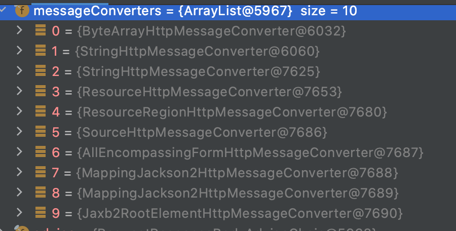

# Controller가 클라이언트의 Request Data를 받아오는 방법

SpringBoot에서 RestController 구현시 요청을 받아오는 방법에 대해서 정리해보려고 한다.

지금 정리하는 방식에는 form data 형식의 요청은 일단 제외하고 클라이언트가 json형태의 데이터를 보내거나, url query에 담아서 보내는 방식만을 정리하려고 한다. ( content-type: `application/json`  )

* [HTTP Method](#http-method)
* [데이터를 받아오는 방법](#데이터를-받아오는-방법)
    + [HttpServletRequest](#httpservletrequest)
    + [@PathVariable](#pathvariable)
    + [@RequestParam](#requestparam)
    + [@ModelAttribute](#modelattribute)
    + [@RequestBody](#requestbody)
* [정리](#정리)

<br/>

## HTTP Method

먼저, HTTP METHOD 중 GET, POST, DELETE에 대해서 간단히만 정리하면 다음과 같다.

#### GET

- 리소스 조회에 사용
- query(쿼리 스트링, 파라미터)로 전달
- body 지원 일부 안함 (Getmapping일 때 requestBody로 받으면 안되는 이유)

#### POST

- body를 통해 전달

#### DELETE

- body에 데이터 포함 안하는걸 권장( GET과 같이 header에 데이터 포함)
    - 톰캣은 request body를 post일때만 파싱한다

**Get과 delete는 url과 query만을 이용해야하고, post만 body를 사용할 수 있다**는 것을 잊지 말아야한다.

원래 DTO에 대충 `@Data`를 붙여놓고 method, query, body 개념 없이 API가 받아올 데이터가 많으면 무작정 @RequestBody를 써버린 것 같은데(dto로 매핑이 바로 되니까 편하다고 생각해서) HTTP Method별로 특징을 파악하고  HttpRequest 객체가 어떻게 받아와지는지를 알고 사용해야할 것 같다.


## 데이터를 받아오는 방법

controller에서 데이터를 받아오는 방법은 5가지가 있다.

- HttpServletRequest
- @PathVariable
- @RequestParam
- @ModelAttribute
- @RequestBody

<Br/>

### HttpServletRequest

```java
@PostMapping("/servlet-request")
public void servletReqeust(HttpServletRequest httpRequest) {
    log.info(httpRequest.getParameter("aa").toString());
    log.info(httpRequest.getParameter("bb").toString());
    log.info(String.valueOf(httpRequest.getAttribute("name"))); // (X) 이렇게 읽어오는거 아님
    log.info(String.valueOf(httpRequest.getAttribute("id"))); // (X) 이렇게 읽어오는거 아님
}
```

<details>
 <summary> httpServletRequest 테스트</summary>

 ```java
@Test
public void HttpservletRequest() throws Exception{
    String json = "{\"name\":\"jisu\", \"id\":1}";
    mockMvc.perform(post("/servlet-request?bb=bb")
            .contentType(MediaType.APPLICATION_JSON_VALUE)
            .param("aa","aa")
            .content(json)) 
            .andDo(print())
            .andReturn();
    // body null
}
 ```

```bash
INFO 17472 --- [    Test worker] c.d.s.httpRequest.RequestBodyController  : aa
INFO 17472 --- [    Test worker] c.d.s.httpRequest.RequestBodyController  : bb
INFO 17472 --- [    Test worker] c.d.s.httpRequest.RequestBodyController  : null
INFO 17472 --- [    Test worker] c.d.s.httpRequest.RequestBodyController  : null
```


</details>


`httpRequest.getParameter("")`로 파라미터로 보낸 값, url등을 받아올 수 있다.

> - 테스트용으로 코드에는 getAttribute를 사용했는데 잘못된 방식이다. JSP같은 서버사이드에서 setAttribute로 설정한 뒤 요청을 보내야 받아올 수 있는 값이다.
> - body에 담아서 요청을 보낸 경우는 `request.getInputStream`과 같은 형태로 읽어올 수 있는데 컨트롤러에서 말고 다른 앞단에 대해 따로 Servlet이나 Filter를 상속받아 커스텀하게 구현을 해야하는 것 같다. 그리고 getInputStream은 서블릿이 실행되고 딱 한번만 읽어오기 때문에 주의해야한다.

<Br/>

### @PathVariable

URL을 처리할 때는 `@PathVariable`을 사용한다. `,` `.`같은 구분자를 넣으면 안된다.

```java
    @GetMapping("/path-variable/{id}/{name}")
    public void pathVariable(@PathVariable Long id, @PathVariable(name = "name") String username) {
        log.info(String.valueOf(id));
        log.info(username);
    }
```

`@GetMapping` 부분 url에 `{}`로 받아올 변수를  적고 파라미터에 `@PathVariable`와 함께 같은 이름으로 적어 받아오면 된다. 만약에 `{}`에 넣은 값과 다른 이름의 변수로 받아오고 싶다면 `@PathVariable(name="name")` 으로 지정해주면 된다.

<Br/>

### @RequestParam

> Annotation which indicates that a method parameter should be bound to a web request parameter.
> Supported for annotated handler methods in Spring MVC and Spring WebFlux as follows:
> In Spring MVC, "request parameters" map to query parameters, form data, and parts in multipart requests. This is because the Servlet API combines query parameters and form data into a single map called "parameters", and that includes automatic parsing of the request body.

Spring에는 `httpRequest.getParameter("")` 를 간편하게 받아올 수 있는 `@RequestParam` 어노테이션을 제공한다.

다음과 같이 사용할 수 있다.

```java
@GetMapping("/request-param")
public void requestParam(@RequestParam String name,
                         @RequestParam Long id,
                         @RequestParam(required = false, defaultValue = "default") String requireValue, // default 처리 
                         @RequestParam Map<String, Object> map // 한번에 받아오려면 이렇게 
                         ){
    log.info(name);
    log.info(String.valueOf(id));
    log.info(requireValue);
    for(Map.Entry<String, Object> entry : map.entrySet()) {
        log.info("{}:{}",entry.getKey(), String.valueOf(entry.getValue()));
    }
}
```

<br/> 주의할 점은, `@RequestParam`을 사용해서 받아오는 변수에 값이 존재하지 않으면 400 error로 응답한다.

```bash
Status = 400
Error message = Required request parameter 'id' for method parameter type Long is not present
```

` @RequestParam(required = false, defaultValue = "default") ` 이렇게 required를 false로 지정하거나, default값을 지정해주면 된다.

<br/>


```java
@RequestParam Map<String, Object> map
```

`@RequestParam Map<String, Object> map` 이렇게 여러개의 param을 map으로 가져올 수도 있다. 그런데 이렇게 사용하는것 여러개를 한번에 처리하고 싶으면 뒤에 나오는 `@ModelAttribute`를 사용하는게 좋을 것 같다.


<details>
  <summary> request param 테스트 </summary>

  ```java
    @Test
    public void requestParam() throws Exception{
        mockMvc.perform(get("/request-param")
                .contentType(MediaType.APPLICATION_JSON_VALUE)
                .param("id","1")
                .param("name","jisu"))
                .andDo(print())
                .andReturn();
    }
  ```

```bash
INFO 18398 --- [    Test worker] c.d.s.httpRequest.RequestBodyController  : jisu
INFO 18398 --- [    Test worker] c.d.s.httpRequest.RequestBodyController  : 1
INFO 18398 --- [    Test worker] c.d.s.httpRequest.RequestBodyController  : default
INFO 18398 --- [    Test worker] c.d.s.httpRequest.RequestBodyController  : id:1
INFO 18398 --- [    Test worker] c.d.s.httpRequest.RequestBodyController  : name:jisu
```

</details>

<Br/>

### @ModelAttribute

>Annotation that binds a method parameter or method return value to a named model attribute, exposed to a web view. Supported for controller classes with @RequestMapping methods.

- 클라이언트가 보내는 HTTP 파라미터들을 특정 Object에 바인딩
    - 생성자 또는 setter메서드 필요
- Query String 및 Form 형식 데이터만 처리

`@ModelAttribute`를 사용하면 `?name=&id=` 받아올 값이 많아졌을 경우에  `@RequestParam`로 하나씩 받아오지 않고  미리 만들어둔 객체로 바인딩시킬 수 있다. 주의할점은 **이때 객체에 각각의 변수에 setter함수(또는 생성자)가 없다면 저장되지 않는다.**

> @ModelAttribute나 @RequestParam을 생략해도 String, int들은 RequestParam으로 기타 객체들은 ModelAttribute로 자동으로 처리해주긴 하지만 무조건 생략해버리진 않는게 좋을 것 같다.

<br/>

```java
@Setter
public class ModelAttributeDto {
    private String name;
    private Long id;
}
```

```java
    @GetMapping("/model-attribute")
    public ResponseEntity<ModelAttributeDto> modelAttribute(@ModelAttribute ModelAttributeDto requestDto) {
        return ResponseEntity.ok(requestDto);
    }
```


<details>
  <summary> 테스트 </summary>

  ```java
    @Test
    public void modelAttribute() throws Exception{
        mockMvc.perform(get("/model-attribute")
                .contentType(MediaType.APPLICATION_JSON_VALUE)
                .param("id","1")
                .param("name","jisu"))
                .andDo(print())
                .andExpect(jsonPath("name").value("jisu"))
                .andExpect(jsonPath("id").value("1"))
                .andReturn();
    }
  ```
</details>


<br/>

#### HttpMediaTypeNotAcceptableException

주의할점은 ModelAttribute로 받아올 DTO 객체에 setter를 생성하지 않고 그냥 사용하면 `Resolved [org.springframework.web.HttpMediaTypeNotAcceptableException: Could not find acceptable representation]` 다음과 같은 에러를 만난다.

입력받은 파라미터 값을 DTO객체에 바인딩 시키기 위해서는 추가적인 설정(setter)이 필요하다.

<br/>

#### 커맨드 객체

HttpServletRequest를 통해 들어온 요청 파라미터들을 setter메서드를 이용하여 객체에 정의되어있는 속성에 바인딩이 되는 객체

커맨드 객체는 보통 DTO를 의미하며, HttpServletRequest로 받아오는 요청 파라미터의 **key값과 동일한 이름의 속성**과 `setter`메서드를 가지고 있어야 한다.

스프링이 내부적으로 HttpServletRequest와 DTO(커맨드 객체)의 setter메서드를 이용해서 알아서 바인딩 시켜준다.

<br/>

#### @ModelAttirbute의 추가 기능 - Validation

@ModelAttribute를 이용하면 @RequestParam과는 달리 검증 작업을 할 수 있다.

RequestParam의 경우 잘못된 요청이 들어오면(값이 없는 경우) `400 Bad Reqeust`응답을 하게되는데, ModelAttribute의 경우에는 잘못된 값이 들어올 경우 `BindingResult` 객체에 실패 결과를 담아 컨트롤러에 전달하므로 그에 따른 추가적인 검증처리가 가능하다.

또는 `@Valid`를 사용해서 검증된 값을 `BindingResult`에 담을 수도 있다. 에러가 발생했는지 확인은  `bindingResult.hasError()` 으로 한다.

-> 이때 Excpetion이 발생하는 것이 아니라 해당 변수에 null이 담기는(바인딩이 되지 않는) 상태가 되므로 잘 처리해주어야한다.

<details>
  <summary> BindingResult사용 </summary>


  ```java
    @Test
  @DisplayName("Long에 String을 넣었을 때 BindingResult 객체에 저장되는지 테스트 ")
  public void modelAttributeBindingResult() throws Exception{
      mockMvc.perform(get("/model-attribute/binding")
              .contentType(MediaType.APPLICATION_JSON_VALUE)
              .param("id","ㅁㄴ")
              .param("name","jisu"))
              .andDo(print())
              .andReturn();
  }
  ```

  ```java
    @GetMapping("/model-attribute/binding")
  public ResponseEntity<String> modelAttributeBindingResult(@ModelAttribute ModelAttributeDto requestDto, BindingResult bindingResult) {
      log.info("request : {},{}",requestDto.getId(), requestDto.getName());
      bindingResult.getFieldErrors().stream()
              .forEach( error-> log.info("{} ,{}", error.getField(), String.valueOf(error.getRejectedValue())));
      return null;
  }
  ```

결과

  ```bash
INFO 20842 --- [    Test worker] c.d.s.httpRequest.RequestBodyController  : request : null,jisu
INFO 20842 --- [    Test worker] c.d.s.httpRequest.RequestBodyController  : id ,ㅁㄴ
  ```

</details>

<details>
  <summary> @Valid와 BindingResult같이 사용 </summary>


DTO에 validation 지정

  ```java
  @Setter
@Getter
public class ModelAttributeDto {

    private String name;
    @Range(min=20, message = "20이상이어야 합니다.")
    private Long id;

}
  ```

```java
      @GetMapping("/model-attribute/valid")
    public ResponseEntity<String> modelAttributeValid(@Valid @ModelAttribute ModelAttributeDto requestDto, BindingResult bindingResult) {
        log.info("request : {},{}",requestDto.getId(), requestDto.getName());

        if(bindingResult.hasErrors()) {
            bindingResult.getFieldErrors().stream()
                    .forEach( error-> log.info("{} ,{}, {}", error.getField(), String.valueOf(error.getRejectedValue()), error.getDefaultMessage()));
        }
        return null;
    }
```

 ```java
     @Test
   @DisplayName("Long에 20 이하의 값을 넣었을 떄BindingResult 객체에 저장되는지 테스트 ")
   public void modelAttributeBindingValid() throws Exception{
       mockMvc.perform(get("/model-attribute/valid")
               .contentType(MediaType.APPLICATION_JSON_VALUE)
               .param("id","10")
               .param("name","jisu"))
               .andDo(print())
               .andReturn();
   } 
 ```

결과

  ```bash
  
 2022-02-09 20:21:04.557  INFO 21074 --- [    Test worker] c.d.s.httpRequest.RequestBodyController  : request : 10,jisu
2022-02-09 20:21:04.559  INFO 21074 --- [    Test worker] c.d.s.httpRequest.RequestBodyController  : id ,10, 20이상이어야 합니다.
  ```

</details>

### <br/>

<details>
  <summary> Get에서 데이터 바인딩 방법 - WebDataBinder 과 Setter 없이 바인딩시키기 </summary>


#### WebDataBinder

위에 적은대로 setter를 사용해야 바인딩이 되는 이유는 GET요청으로 들어오는 Query parameter의 경우 `WebDataBinder`를 사용하는데 기본 값으로 값을 할당하는 방법이 **Java Bean** 방식이다 (Setter를 통한 값 할당 )

```java
/**
 * Initialize standard JavaBean property access for this DataBinder.
 * <p>This is the default; an explicit call just leads to eager initialization.
 * @see #initDirectFieldAccess()
 * @see #createBeanPropertyBindingResult()
 */
public void initBeanPropertyAccess() {
   Assert.state(this.bindingResult == null,
         "DataBinder is already initialized - call initBeanPropertyAccess before other configuration methods");
   this.directFieldAccess = false;
}
```

만약에 Setter를 사용하지 않고도 값을 받아오게 하려면 컨트롤러에 @InitBinder어노테이션을 이용해서 `initDirectFieldAccess` 설정으로 setter 없이 direct access 하게 할 수 있다.

```java
/**
 * Initialize direct field access for this DataBinder,
 * as alternative to the default bean property access.
 * @see #initBeanPropertyAccess()
 * @see #createDirectFieldBindingResult()
 */
public void initDirectFieldAccess() {
   Assert.state(this.bindingResult == null,
         "DataBinder is already initialized - call initDirectFieldAccess before other configuration methods");
   this.directFieldAccess = true;
}
```

```java
    @InitBinder
    public void initBinder(WebDataBinder binder) {
        binder.initDirectFieldAccess();
    }
```

컨트롤러에 이걸 추가하고 DTO에 setter를 삭제했더니 바인딩이 성공했다.

- https://jojoldu.tistory.com/407


WebDataBinder (converter, databinder, formatter... )등과 관련해서는 따로 정리해야겠다.. 너무 많다 . .


</details>


### <br/>


### @RequestBody

> Annotation indicating a method parameter should be bound to the body of the web request. The body of the request is passed through an HttpMessageConverter to resolve the method argument depending on the content type of the request. Optionally, automatic validation can be applied by annotating the argument with @Valid.

클라이언트가 보내는 HTTP 요청 본문 ( JSON, XML 등)을 `HttpMessageConverter` 를 통해 타입에 맞는 자바 객체로 변환한다.


<details>
  <summary> readWithMessageConverters 함수 전체 </summary>

```java
  protected <T> Object readWithMessageConverters(HttpInputMessage inputMessage, MethodParameter parameter,
			Type targetType) throws IOException, HttpMediaTypeNotSupportedException, HttpMessageNotReadableException {

		MediaType contentType;
		boolean noContentType = false;
		try {
			contentType = inputMessage.getHeaders().getContentType();
		}
		catch (InvalidMediaTypeException ex) {
			throw new HttpMediaTypeNotSupportedException(ex.getMessage());
		}
		if (contentType == null) {
			noContentType = true;
			contentType = MediaType.APPLICATION_OCTET_STREAM;
		}
	
		Class<?> contextClass = parameter.getContainingClass();
		Class<T> targetClass = (targetType instanceof Class ? (Class<T>) targetType : null);
		if (targetClass == null) {
			ResolvableType resolvableType = ResolvableType.forMethodParameter(parameter);
			targetClass = (Class<T>) resolvableType.resolve();
		}
	
		HttpMethod httpMethod = (inputMessage instanceof HttpRequest ? ((HttpRequest) inputMessage).getMethod() : null);
		Object body = NO_VALUE;
	
		EmptyBodyCheckingHttpInputMessage message = null;
		try {
			message = new EmptyBodyCheckingHttpInputMessage(inputMessage);
	
			for (HttpMessageConverter<?> converter : this.messageConverters) {
  // 이 부분에서 약 10가지의 MessageConverter에서 받아온 데이터에 해당하는 값에 대해서 변환한다. json형식이면 MappingJackson2HttpMessageConverter 
				Class<HttpMessageConverter<?>> converterType = (Class<HttpMessageConverter<?>>) converter.getClass();
				GenericHttpMessageConverter<?> genericConverter =
						(converter instanceof GenericHttpMessageConverter ? (GenericHttpMessageConverter<?>) converter : null);
				if (genericConverter != null ? genericConverter.canRead(targetType, contextClass, contentType) :
						(targetClass != null && converter.canRead(targetClass, contentType))) {
					if (message.hasBody()) {
						HttpInputMessage msgToUse =
								getAdvice().beforeBodyRead(message, parameter, targetType, converterType);
						body = (genericConverter != null ? genericConverter.read(targetType, contextClass, msgToUse) :
								((HttpMessageConverter<T>) converter).read(targetClass, msgToUse));
						body = getAdvice().afterBodyRead(body, msgToUse, parameter, targetType, converterType);
					}
					else {
						body = getAdvice().handleEmptyBody(null, message, parameter, targetType, converterType);
					}
					break;
				}
			}
		}
		catch (IOException ex) {
			throw new HttpMessageNotReadableException("I/O error while reading input message", ex, inputMessage);
		}
		finally {
			if (message != null && message.hasBody()) {
				closeStreamIfNecessary(message.getBody());
			}
		}

		if (body == NO_VALUE) {
			if (httpMethod == null || !SUPPORTED_METHODS.contains(httpMethod) ||
					(noContentType && !message.hasBody())) {
				return null;
			}
			throw new HttpMediaTypeNotSupportedException(contentType,
					getSupportedMediaTypes(targetClass != null ? targetClass : Object.class));
		}
	
		MediaType selectedContentType = contentType;
		Object theBody = body;
		LogFormatUtils.traceDebug(logger, traceOn -> {
			String formatted = LogFormatUtils.formatValue(theBody, !traceOn);
			return "Read \"" + selectedContentType + "\" to [" + formatted + "]";
		});
	
		return body;
	}
```

</details>


#### HttpMessageConverter

> Strategy interface for converting from and to HTTP requests and responses.

- @RequestBody를 사용하면 요청 본문 데이터가 적합한 HttpMessageConverter를 통해 파싱되어 자바 객체로 변환된다.
- 종류
    - StringHttpMessageConverter : 기본 문자 처리
    - MappingJackson2HttpMessageConverter 기본 객체 처리
    - 

</br>

#### Jackson

SpringBoot에서 기본적으로 제공되는 라이브러리이다. (`spring-boot-starter-web`)

```java
ObjectMapper objectMapper = new ObjectMapper();
objectMapper.readValue(messagBody, DataDto.class); 
```

이런식으로 읽어옴

<br/>

#### MappingJackson2HttpMessageConverter

body로 json값이 들어오면 Spring에 등록된 여러 converter중 해당 컨버터를 사용해서 기본적인 객체를 처리한다.

ObjectMapper를 통해서 Json값을 Java 객체로 역직렬화

> 직렬화 - 자바의 객체를 외부 데이터(바이트 형태)로 데이터 변환하는 것
>
> 역직렬화 - 직렬화로 저장된 파일을 다시 자바의 객체로 만드는 것

이때 Jackson의 ObjectMapper는 Json object필드를 java object필드에 매핑 할 때 getter, 메서드를 이용해 (접두사를 지우고 나머지 문자를 소문자로 변환하여 문자열 참조) 필드명을 알아내 매핑시킨다.

`@RequestBody` 사용시 DTO에 getter 메서드가 없으면 DTO가 null로 채워진다.

<br/>

#### @RequestBody가 값을 받아오는 방법 테스트

##### objectMapper가 readValue

```java
public class RequestBodyDto {
    String name;
    Long age;
    Color favoriteColor;
}
```

```java
@Test 
@DisplayName("RequestBodyDto objectMapper 테스트")
public void reqeustBodyObjectMapper() throws JsonProcessingException {
    String requestBody = "{\"name\": \"jisu\",\"age\": 1,\"favoriteColor\" : \"RED\"}";
    RequestBodyDto requestBodyDto = objectMapper.readValue(requestBody, RequestBodyDto.class);
}
```

1. getter, setter, 생성자 모두 없을때 -> 실패
2. getter 있을때 -> 성공
3. setter 있을때 -> 성공
4. 생성자만(All,NO 모두 ) 있을때 -> 실패

-> getter또는 Setter가 있어야한다. 아니면 `@JsonProperty(value="name")`으로 지정해줘야한다.

<br/>

- `@WebMvcTest`할 때 `@ReqeustBody` 부분 값 넣어 보내는 방법 json String, object mapping 2가지

```java
@Test
@DisplayName("requestBody 테스트")
public void requestBody() throws Exception {
    String requestBody = "{\"name\": \"jisu\",\"age\": 1,\"favoriteColor\" : \"RED\"}";
    mockMvc.perform(post("/request-body")
            .contentType(MediaType.APPLICATION_JSON_VALUE)
            .content(requestBody))
            .andExpect(jsonPath("name").value("jisu"))
            .andExpect(jsonPath("age").value(1))
            .andExpect(jsonPath("favoriteColor").value("RED"))
            .andDo(print())
            .andReturn();
}

@Test
@DisplayName("requestBody 테스트 Map")
public void requestBodyMap() throws Exception {
    HashMap<String, Object> map = new HashMap<>();
    map.put("name","jisu");
    map.put("age",1);
    map.put("favoriteColor","RED");
    mockMvc.perform(post("/request-body")
            .contentType(MediaType.APPLICATION_JSON_VALUE)
            .content(objectMapper.writeValueAsString(map)))
            .andExpect(jsonPath("name").value("jisu"))
            .andExpect(jsonPath("age").value(1))
            .andExpect(jsonPath("favoriteColor").value("RED"))
            .andDo(print())
            .andReturn();
}
```

- Long <-> String | Enum <-> 맞지 않는 String 같이 body에 값이 아예 잘못 입력될 경우
    - HTTP 400 Bad Reqeust
    - controller에서 처리하기 전에 Exception처리되기때문에 따로 처리하고 싶으면 converter를 사용해야한다.
    - Enum의 경우 Enum class에 @JsonCreator로 처리하는 방법도 있긴 한데
        - null로 변경 -> Enum 값에 null이 들어가서 애매함, null로 변경시킨 후 validation하면 에러처리할때 메세지에 잘못입력한값을 null로 표시해야됨(사용자가 실제로 잘못 입력한 값 말고 )
        - throw exception -> exception 메세지가 변경되기는 하는데 똑같이 400 bad request (HttpMessageNotReadableException)인 상태로 메세지만 다르게 들어감. 다른 400 에러랑 같이 HttpMessageNotReadableException 핸들러에서 처리하는게 뭔가 별로임
        - 여튼 Enum값은 custom converter -> @JsonCreator or objectMapper -> validation  이 순서로 처리되는 것 같은데 핸들링하고싶은 상황 봐서 하면 될듯..
- Long, String, Enum 지정한 타입에 맞게 들어왔는데 그 안에서 validation을 하는 경우 (@Valid사용)
    - Errors 객체로 받아와 컨트롤러 내부에서 throw excpetion 해주거나 다른 Default값으로 바꿔줌
    - GlobalExceptionHandler를 만들어서 `MethodArgumentNotValidException`에 대해서 처리
    - Validated로 지정하는건 좀 더 알아보기

```java
@Test
@DisplayName("requestBody 테스트 Map 값 잘못 들어갔을 때 ")
public void requestBodyERROR() throws Exception {
    HashMap<String, Object> map = new HashMap<>();
    map.put("name","jisu");
    map.put("age","ㅁㅇㅁㅇ");
    map.put("favoriteColor","RD");
    mockMvc.perform(post("/request-body")
            .contentType(MediaType.APPLICATION_JSON_VALUE)
            .content(objectMapper.writeValueAsString(map)))
            .andExpect(status().isBadRequest())
            .andDo(print())
            .andReturn();
```

<br/>

- requestBody로 지정한 Dto의 변수의 이름이 aa가아니고 aaAA같은 형식일때 처리가 잘 안되는경우는 https://bcp0109.tistory.com/309 이 블로그 참고

<br/>

## 정리

클라이언트가 데이터를 보내게된다면 이런식의 경우가 있을 것인데, HttpServletRequest를 제외하고 미리 사용법을 정리하면 다음과 같다

1. http://localhost:8080/board/1

    1. @PathVariable사용

2. http://localhost:8080/board?id=1&name=kang

    1. @RequestParam, @ModelAttribute 사용

3. http://localhost:8080/board

    1. POST에서 @RequestBody 사용

   ```
   //body
   {
     "id":1,
     "name":"kang",
   }
   ```

> 출처
>
> - https://medium.com/webeveloper/modelattribute-%EC%99%80-%EC%BB%A4%EB%A7%A8%EB%93%9C-%EA%B0%9D%EC%B2%B4-command-object-42c14f268324
> - https://tecoble.techcourse.co.kr/post/2021-05-11-requestbody-modelattribute/
> - https://jojoldu.tistory.com/407
> - https://doing7.tistory.com/10
> - https://velog.io/@conatuseus/RequestBody%EC%97%90-%EA%B8%B0%EB%B3%B8-%EC%83%9D%EC%84%B1%EC%9E%90%EB%8A%94-%EC%99%9C-%ED%95%84%EC%9A%94%ED%95%9C%EA%B0%80

