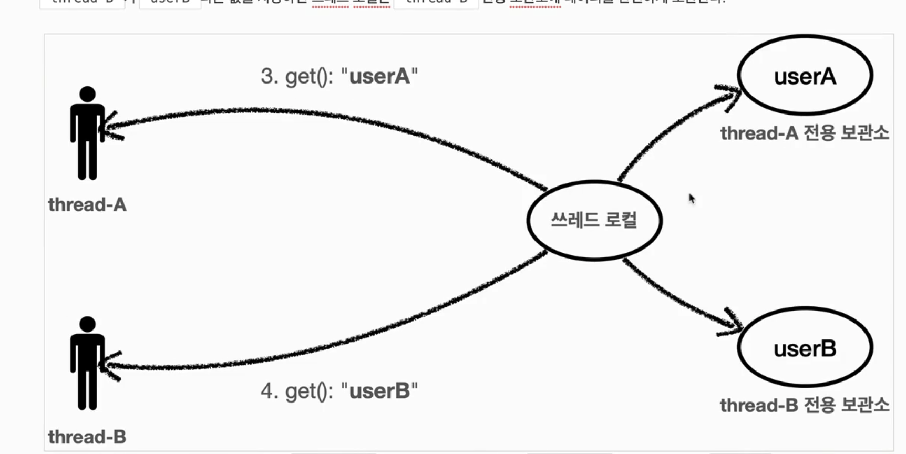

## 쓰레드 로컬

### 필드 동기화 - 개발

- 파라미터로 넘기며 TraceId를 동기화하는 문제


**LogTrace interface / TraceIdHolder**

- `LogTrace` 를 구현한 `FieldLogTrace` 를 만들고 전역변수로 `TraceId TraceIdHolder` 를 생성해 `begin` , `complete` 에서 TraceId를 가져다 쓰고 동기화해준다.

```java
public class FieldLogTrace implements LogTrace {
  ..
      private TraceId traceIdHolder; // traceId 동기화, 동시성 이슈 발생
  ..
}
```


```java
    private void syncTraceId() {
        if (traceIdHolder == null) {
            traceIdHolder = new TraceId();
        } else {
            traceIdHolder = traceIdHolder.createNextId();
        }
    }
```

```java
    private void releaseTraceId() {
        if (traceIdHolder.isFirstLevel()) {
            traceIdHolder = null; // destroy
        } else {
            traceIdHolder = traceIdHolder.createPreviousId();
        }
    }
```


### 필드 동기화 - 적용

- FieldLogTrace를 Spring Bean에 등록 - 싱글톤으로 등록이 됨

```java
@Configuration
public class LogTraceConfig {
    @Bean
    public LogTrace logTrace() {
        return new FieldLogTrace();
    }
}
```


### **동시성 문제**

1초에 2번 호출했더니 이런식으로 됨

```bash
2023-07-30T15:11:45.270+09:00  INFO 20482 --- [nio-8080-exec-6] h.advanced.trace.logtrace.FieldLogTrace  : [e6760c31] OrderController.request()
2023-07-30T15:11:45.270+09:00  INFO 20482 --- [nio-8080-exec-6] h.advanced.trace.logtrace.FieldLogTrace  : [e6760c31] |-->OrderService.orderItem()
2023-07-30T15:11:45.270+09:00  INFO 20482 --- [nio-8080-exec-6] h.advanced.trace.logtrace.FieldLogTrace  : [e6760c31] |      |-->OrderRepository.save()
2023-07-30T15:11:46.005+09:00  INFO 20482 --- [nio-8080-exec-7] h.advanced.trace.logtrace.FieldLogTrace  : [e6760c31] |      |      |-->OrderController.request()
2023-07-30T15:11:46.006+09:00  INFO 20482 --- [nio-8080-exec-7] h.advanced.trace.logtrace.FieldLogTrace  : [e6760c31] |      |      |      |-->OrderService.orderItem()
2023-07-30T15:11:46.006+09:00  INFO 20482 --- [nio-8080-exec-7] h.advanced.trace.logtrace.FieldLogTrace  : [e6760c31] |      |      |      |      |-->OrderRepository.save()
2023-07-30T15:11:46.270+09:00  INFO 20482 --- [nio-8080-exec-6] h.advanced.trace.logtrace.FieldLogTrace  : [e6760c31] |      |<--OrderRepository.save() time=1000ms
2023-07-30T15:11:46.270+09:00  INFO 20482 --- [nio-8080-exec-6] h.advanced.trace.logtrace.FieldLogTrace  : [e6760c31] |<--OrderService.orderItem() time=1000ms
2023-07-30T15:11:46.271+09:00  INFO 20482 --- [nio-8080-exec-6] h.advanced.trace.logtrace.FieldLogTrace  : [e6760c31] OrderController.request() time=1001ms
2023-07-30T15:11:47.010+09:00  INFO 20482 --- [nio-8080-exec-7] h.advanced.trace.logtrace.FieldLogTrace  : [e6760c31] |      |      |      |      |<--OrderRepository.save() time=1004ms
2023-07-30T15:11:47.011+09:00  INFO 20482 --- [nio-8080-exec-7] h.advanced.trace.logtrace.FieldLogTrace  : [e6760c31] |      |      |      |<--OrderService.orderItem() time=1005ms
2023-07-30T15:11:47.011+09:00  INFO 20482 --- [nio-8080-exec-7] h.advanced.trace.logtrace.FieldLogTrace  : [e6760c31] |      |      |<--OrderController.request() time=1006ms
```

`nio-8080-exec-n` 쓰레드 번호가 다른데 TraceId는 같음


- FieldLogTrace는 싱글톤으로 등록된 스프링 빈인데, 객체의 인스턴스가 애플리케이션에 딱 1개만 존재한다. 
- 하나만 있는 인스턴스의 FieldLogTrace.traceIdHolder 필드를 여러 쓰레드가 동시에 접근하기 때문에 문제가 발생한다


### 동시성

###  문제 - 예제 코드

```groovy
// build.gralde
// 테스트에서 lombok 사용

	testCompileOnly 'org.projectlombok:lombok'
	testAnnotationProcessor 'org.projectlombok:lombok'
```

```java
    public String logic(String name) {
        log.info("저장 name={} --> nameStore={}", name, nameStore);
        nameStore = name;
        sleep(1000);
        log.info("조회 nameStore={}", nameStore);
        return nameStore;
    }
```


```java
package hello.advanced.trace.threadlocal;

import hello.advanced.trace.threadlocal.code.FieldService;
import lombok.extern.slf4j.Slf4j;
import org.junit.jupiter.api.Test;

@Slf4j
public class FieldServiceTest {
    private FieldService fieldService = new FieldService();

    @Test
    void field() {
        log.info("main start");
        Runnable userA = () -> {
            fieldService.logic("userA");
        };
        Runnable userB = () -> {
            fieldService.logic("userB");
        };
        Thread threadA = new Thread(userA);
        threadA.setName("thread-A");
        Thread threadB = new Thread(userB);
        threadB.setName("thread-B");

        threadA.start();
        sleep(2000); // 동시성 문제 발생 X
        threadB.start();

        sleep(3000); // 메인 쓰레드 종료 대기
        log.info("main exit");
    }


    private void sleep(int millis) {
        try {
            Thread.sleep(millis);
        } catch (InterruptedException e) {
            e.printStackTrace();
        }
    }
}

```

- threadA가 nameStore=userA를 사용
- threadB가 nameStore=userB를 사용

```bash
15:27:32.799 [main] INFO hello.advanced.trace.threadlocal.FieldServiceTest -- main start
15:27:32.805 [thread-A] INFO hello.advanced.trace.threadlocal.code.FieldService -- 저장 name=userA --> nameStore=null
15:27:33.811 [thread-A] INFO hello.advanced.trace.threadlocal.code.FieldService -- 조회 nameStore=userA
15:27:34.809 [thread-B] INFO hello.advanced.trace.threadlocal.code.FieldService -- 저장 name=userB --> nameStore=userA
15:27:35.814 [thread-B] INFO hello.advanced.trace.threadlocal.code.FieldService -- 조회 nameStore=userB
15:27:37.811 [main] INFO hello.advanced.trace.threadlocal.FieldServiceTest -- main exit
```


**sleep(2000)을 안넣어주면**

```bash
15:29:12.904 [main] INFO hello.advanced.trace.threadlocal.FieldServiceTest -- main start
15:29:12.909 [thread-A] INFO hello.advanced.trace.threadlocal.code.FieldService -- 저장 name=userA --> nameStore=null
15:29:13.014 [thread-B] INFO hello.advanced.trace.threadlocal.code.FieldService -- 저장 name=userB --> nameStore=userA
15:29:13.913 [thread-A] INFO hello.advanced.trace.threadlocal.code.FieldService -- 조회 nameStore=userB
15:29:14.018 [thread-B] INFO hello.advanced.trace.threadlocal.code.FieldService -- 조회 nameStore=userB
15:29:16.018 [main] INFO hello.advanced.trace.threadlocal.FieldServiceTest -- main exit
```

- 저장은 문제가 없음
- 조회할 때 nameStore에 저장해있던 userA의 값이 nameB로 바뀌어버려서 threadA에서 조회할 때 문제가 생김


**동시성 문제**

- 트래픽이 많아질 수록 스프링 빈 처럼 싱글톤 객체의 필드를 변경하며 사용할 때는 이런 동시성 문제를 조심해야한다.
- 동시성 문제는 지역변수에서는 발생하지 않는다. 
- 동시성 문제는 같은 인스턴스의 필드, 공용필드에 접근할 때 나타나며 값을 읽기만 할 때는 발생하지 않는다. 어디선가 변경하는 코드가 있으면 나타날 수 있다.


### ThreadLocal

- 해당 쓰레드만 접근할 수 있는 특별한 저장소를 말한다.

- 각 쓰레드마다 별도의 내부 저장소를 제공해 같은 인스턴스의 쓰레드 로컬 필드에 접근해도 문제 없다.

  

- 


- `java.lang.ThreadLocal` 을 자바에서 지원해준다.


### ThreadLocal 예제 코드

```java
    private ThreadLocal<String> nameStore = new ThreadLocal<>();
    public String logic(String name) {
        log.info("저장 name={} --> nameStore={}", name, nameStore);
        nameStore.set(name);
        sleep(1000);
        log.info("조회 nameStore={}", nameStore.get());
        return nameStore.get();
    }
```


**주의**

- 해당 쓰레드가 쓰레드 로컬을 모두 사용하고 나면 `ThreadLocal.remove()` 를 호출해서 쓰레드 로컬에 저장된 값을 제거해주어야 한다. 
- 메모리 누수가 날 수 있음

```java
19:29:46.117 [thread-A] INFO hello.advanced.trace.threadlocal.code.ThreadLocalService -- 저장 name=userA --> nameStore=java.lang.ThreadLocal@2ff11551
19:29:46.220 [thread-B] INFO hello.advanced.trace.threadlocal.code.ThreadLocalService -- 저장 name=userB --> nameStore=java.lang.ThreadLocal@2ff11551
19:29:47.119 [thread-A] INFO hello.advanced.trace.threadlocal.code.ThreadLocalService -- 조회 nameStore=userA
19:29:47.225 [thread-B] INFO hello.advanced.trace.threadlocal.code.ThreadLocalService -- 조회 nameStore=userB
```


### 쓰레드 로컬 동기화 개발

`TraceId traceIdHolder` 를 사용하는 필드를 쓰레드 로컬을 사용하도록 변경

```java
public class ThreadLocalLogTrace implements LogTrace {
  
    private ThreadLocal<TraceId> traceIdHolder = new ThreadLocal<>();
}
```

```java
    private void syncTraceId() {
        TraceId traceId = traceIdHolder.get();
        if (traceId == null) {
            traceIdHolder.set(new TraceId());
        } else {
            traceIdHolder.set(traceId.createNextId());
        }
    }

    private void releaseTraceId() {
        TraceId traceId = traceIdHolder.get();
        if (traceId.isFirstLevel()) {
            traceIdHolder.remove();
        } else {
            traceIdHolder.set(traceId.createPreviousId());
        }
    }
```

```bash
3-07-30T19:34:39.888+09:00  INFO 22576 --- [nio-8080-exec-2] h.a.trace.logtrace.ThreadLocalLogTrace   : [3e208614] OrderController.request()
2023-07-30T19:34:39.888+09:00  INFO 22576 --- [nio-8080-exec-2] h.a.trace.logtrace.ThreadLocalLogTrace   : [3e208614] |-->OrderService.orderItem()
2023-07-30T19:34:39.888+09:00  INFO 22576 --- [nio-8080-exec-2] h.a.trace.logtrace.ThreadLocalLogTrace   : [3e208614] |      |-->OrderRepository.save()
2023-07-30T19:34:40.439+09:00  INFO 22576 --- [nio-8080-exec-3] h.a.trace.logtrace.ThreadLocalLogTrace   : [fd4ca8fc] OrderController.request()
2023-07-30T19:34:40.439+09:00  INFO 22576 --- [nio-8080-exec-3] h.a.trace.logtrace.ThreadLocalLogTrace   : [fd4ca8fc] |-->OrderService.orderItem()
2023-07-30T19:34:40.439+09:00  INFO 22576 --- [nio-8080-exec-3] h.a.trace.logtrace.ThreadLocalLogTrace   : [fd4ca8fc] |      |-->OrderRepository.save()
2023-07-30T19:34:40.893+09:00  INFO 22576 --- [nio-8080-exec-2] h.a.trace.logtrace.ThreadLocalLogTrace   : [3e208614] |      |<--OrderRepository.save() time=1005ms
2023-07-30T19:34:40.893+09:00  INFO 22576 --- [nio-8080-exec-2] h.a.trace.logtrace.ThreadLocalLogTrace   : [3e208614] |<--OrderService.orderItem() time=1005ms
2023-07-30T19:34:40.893+09:00  INFO 22576 --- [nio-8080-exec-2] h.a.trace.logtrace.ThreadLocalLogTrace   : [3e208614] OrderController.request() time=1006ms
2023-07-30T19:34:41.443+09:00  INFO 22576 --- [nio-8080-exec-3] h.a.trace.logtrace.ThreadLocalLogTrace   : [fd4ca8fc] |      |<--OrderRepository.save() time=1004ms
2023-07-30T19:34:41.443+09:00  INFO 22576 --- [nio-8080-exec-3] h.a.trace.logtrace.ThreadLocalLogTrace   : [fd4ca8fc] |<--OrderService.orderItem() time=1004ms
2023-07-30T19:34:41.444+09:00  INFO 22576 --- [nio-8080-exec-3] h.a.trace.logtrace.ThreadLocalLogTrace   : [fd4ca8fc] OrderController.request() time=1005ms
```


### 쓰레드 로컬 - 주의사항

- 쓰레드 로컬의 값을 사용 후 제거하지 않고 그냥 두면 WAS(톰캣)처럼 쓰레드 풀을 사용하는 경우에 심각한 문제가 발생할 수 있다.


- 사용자 A의 HTTP응답이 끝난다.
- WAS는 사용이 끝난 쓰레드(`thread-A`)를 쓰레드 풀에 반환한다. 쓰레드 생성 비용이 비싸기 때문에 쓰레드를 제거하지 않고 보통 쓰레드 풀을 통해서 재사용한다.
- `thread-A` 는 쓰레드풀에 아직 살아있어서 쓰레드 로컬 `thread-A` 전용 보관소에 사용자 A의 데이터가 함께 살아있다.


- 사용자 B가 조회를 위한 HTTP요청을 했을 때 `thread-A` 가 할당되면, 사용자 B에 사용자 A의 정보를 보게될 수가 있다.
- 이런 문제를 예방하려면 `ThreadLocal.remove()` 를 통해서 제거해야한다.


### 정리

- traceIdHolder (싱글톤 인스턴스에 전역 변수 사용)
  - 동시성 문제 발생
- Thread별 저장소를 따로 두기 위한 ThreadLocal 사용
  - 같은 인스턴스에서 같은 필드에 접근해도 문제가 없음
- `ThreadLocal<>`
- Config에 설정한 Bean을 변경해주면 인터페이스 구현체만 바꿔주면 바로 바꿀 수 있음 
  - FieldLogTrace
  - ThreadLocalLogTrace

