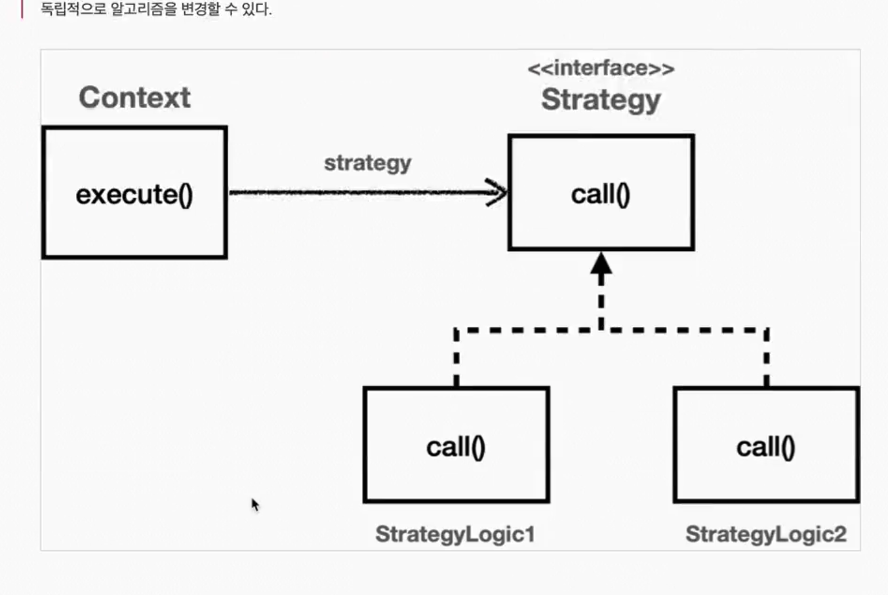
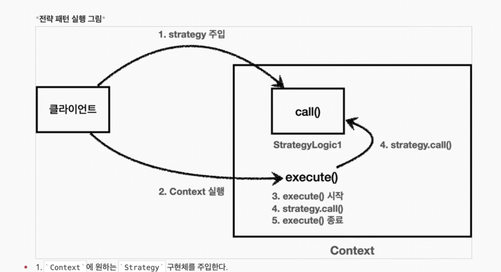

## 전략 패턴

전략 패턴은 변하지 않는 부분을 `Context` 라는 곳에 두고, 변하는 부분을 `Strategy` 라는 인터페이스를 만들고 해당 인터페이스를 구현하도록 해서 문제를 해결한다.

상속이 아니라 위임으로 문제를 해결하는 것이다.


> 템플릿 패턴과 비교하면
>
> `Context` : 템플릿 역할
>
> `Strategy` : 알고리즘 역할


GOF 디자인 패턴에서 정의한 전략 패턴의 의도는 다음과 같다.

> 알고리즘 제품군을 정의하고 각각을 캡슐화하여 상호 교환 가능하게 만들자. 전략을 사용하면 알고리즘을 사용하는 클라이언트와 독립적으로 알고리즘을 변경할 수 있다.



### 예제 1

전략패턴의 핵심은 Context는 Strategy 인터페이스에만 의존한다는 것이다. 덕분에 Strategy의 구현체를 변경하거나 새로 만들어도 Context 코드에는 영향을 주지 않는다.


```java
    @Test
    void strategyV1() {
        StrategyLogic1 strategyLogic1 = new StrategyLogic1();
        ContextV1 contextV1 = new ContextV1(strategyLogic1);
        contextV1.execute();

        StrategyLogic2 strategyLogic2 = new StrategyLogic2();
        ContextV1 contextV2 = new ContextV1(strategyLogic2);
        contextV2.execute();
    }
```

```bash
23:39:46.010 [main] INFO hello.advanced.trace.strategy.code.strategy.StrategyLogic1 -- 비즈니스 로직1 실행
23:39:46.015 [main] INFO hello.advanced.trace.strategy.code.strategy.ContextV1 -- resultTime = 6
23:39:46.017 [main] INFO hello.advanced.trace.strategy.code.strategy.StrategyLogic2 -- 비즈니스 로직2 실행
23:39:46.017 [main] INFO hello.advanced.trace.strategy.code.strategy.ContextV1 -- resultTime = 0
```





Strategy 구현체는 부모클래스가 Strategy 인터페이스여서 Context가 어떻게 생기든 영향을 받지 않음! 템플릿 메서드 패턴에서 부모 클래스에 영향을 받던거보다는 변경에 영향을 덜 받는 안정적인 개발이 가능하다.


### 예제 2

> 익명 내부클래스 사용

```java
    @Test
    void strategyV2() {
        Strategy strategyLogic1 = new Strategy() {
            @Override
            public void call() {
                log.info("비즈니스 로직1 실행");
            }
        };

        ContextV1 contextV1 = new ContextV1(strategyLogic1);
        log.info("strategyLogic1={}", strategyLogic1.getClass());
        contextV1.execute();
        Strategy strategyLogic2 = new Strategy() {
            @Override
            public void call() {
                log.info("비즈니스 로직1 실행");
            }
        };

        ContextV1 contextV2 = new ContextV1(strategyLogic2);
        log.info("strategyLogic2={}", strategyLogic2.getClass());
        contextV2.execute();
    }
```

```java
23:44:12.243 [main] INFO hello.advanced.trace.strategy.ContextV1Test -- strategyLogic1=class hello.advanced.trace.strategy.ContextV1Test$1
23:44:12.248 [main] INFO hello.advanced.trace.strategy.ContextV1Test -- 비즈니스 로직1 실행
23:44:12.248 [main] INFO hello.advanced.trace.strategy.code.strategy.ContextV1 -- resultTime = 0
23:44:12.249 [main] INFO hello.advanced.trace.strategy.ContextV1Test -- strategyLogic2=class hello.advanced.trace.strategy.ContextV1Test$2
23:44:12.249 [main] INFO hello.advanced.trace.strategy.ContextV1Test -- 비즈니스 로직1 실행
23:44:12.249 [main] INFO hello.advanced.trace.strategy.code.strategy.ContextV1 -- resultTime = 
```


inline으로

```java
ContextV1 contextV1 = new ContextV1(new Strategy() {
  @Override
  public void call() {
    log.info("비즈니스 로직1 실행");
  }
});
contextV1.execute();
ContextV1 contextV2 = new ContextV1(new Strategy() {
  @Override
  public void call() {
    log.info("비즈니스 로직1 실행");
  }
});
contextV2.execute();
```


람다 사용

```java
    @Test
    void strategyV4() {
        ContextV1 contextV1 = new ContextV1(() -> log.info("비즈니스 로직1 실행"));
        contextV1.execute();
        ContextV1 contextV2 = new ContextV1(() -> log.info("비즈니스 로직2 실행"));
        contextV2.execute();
    }

```


익명 내부 클래스를 자바 8부터 제공하는 람다로 변경할 수 있다 (람다를 사용하려면 인터페이스의 메서드가 1개만 있으면 된다.)


**선 조립, 후 실행**

Context와 Strategy를 실행하기 전에 미리 원하는 모양으로 조립해두고, 그다음에 Context를 실행하는 선 조립, 후 실행 방식에서 유용하다.

한번 조립하고 난 이후에는 Context를 실행하기만 하면 된다. 

스프링으로 애플리케이션을 개발할 때 로딩 시점에 의존관계 주입을 통해 필요한 의존관계를 모두 맺어두고 난 다음에 실제 요청을 처리하는 것과 같은 원리이다.


**단점**

이 방식의 단점은 한번 조립한 후에는 **전략을 변경하기가 번거롭다는 점**이다.

 Context에 setter를 제공해서 Strategy를 넘겨 받아 변경하면 되지만, 싱글톤으로 사용할 때는 동시성 이슈 등 고려할 점이 많다. 

그래서 전략을 실시간으로 변경해야 하면 차라리 이전에 개발한 테스트 코드처럼 Context를 하나 더 생성하고 다른 Strategy를 주입하는 방법이 나을 수도 있다.


### 예제3

> 전략 패턴을 조금 다르게 사용해보기 
>
> 전략을 실행하는 시점에 파라미터로 전달하기

```java
@Slf4j
public class ContextV2 {

    public void execute(Strategy strategy) {
        long startTime = System.currentTimeMillis();

        // 비즈니스 로직 실행
        strategy.call(); // 위임
        // 비즈니스 로직 종료

        long endTime = System.currentTimeMillis();
        long resultTime = endTime - startTime;

        log.info("resultTime = {}", resultTime);
    }
}


```

```java
    @Test
    void strategyV1() {
        ContextV2 context = new ContextV2();
        context.execute(new StrategyLogic1());
        context.execute(new StrategyLogic2());
    }
```


`Context` 를 실행할 때 마다 전략을 인수로 전달한다. 이전 방식과 비교해서 원하는 전략을 더욱 유연하게 변경할 수 있다.


```java
    @Test
    void strategyV2() {
        ContextV2 context = new ContextV2();
        context.execute(new Strategy() {
            @Override
            public void call() {
                log.info("비즈니스 로직1 실행");
            }
        });
        context.execute(new Strategy() {
            @Override
            public void call() {
                log.info("비즈니스 로직2 실행");
            }
        });
    }
    @Test
    void strategyV3() {
        ContextV2 context = new ContextV2();
        context.execute(() -> log.info("비즈니스 로직1 실행"));
        context.execute(() -> log.info("비즈니스 로직2 실행"));
    }

```


**정리**

- `ContextV1` 은 필드에 `Strategy` 를 저장하는 방식으로 전략 패턴을 구사했다.
  - 선 조립, 후 실행 방법에 적합하다.
  - 실행 시점에는 이미 조립이 끝났기 때문에 전략을 신경쓰지 않고 단순히 실행만 하면 된다.
  - `ContextV2` 는 파라미터에 `Strategy` 를 전달받는 방식으로 전략 패턴을 구사했다.
    - 실행할 때 마다 전략을 유연하게 변경할 수 있다.
    - 단점 역시 실행할 때 마다 전략을 계속 지정해주어야 한다는 점이다.


**템플릿**

우리가 해결하고 싶은 문제는 변하는 부분과 변하지 않는 부분을 분리하는 것

변하지 않는 부분을 **템플릿** 이라고 하고 그 템플릿 안에는 변하는 부분에 약간 다른 코드 조각을 넘겨서 실행하는 것이 목적이다.

우리가 고민하는 문제에는 실행 시점에 유연하게 실행 코드 조각을 전달하는 ContextV2가 더 적합하다.


